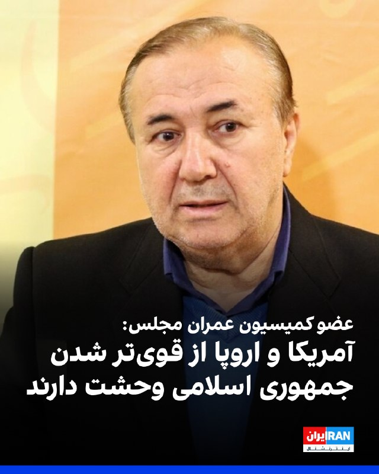
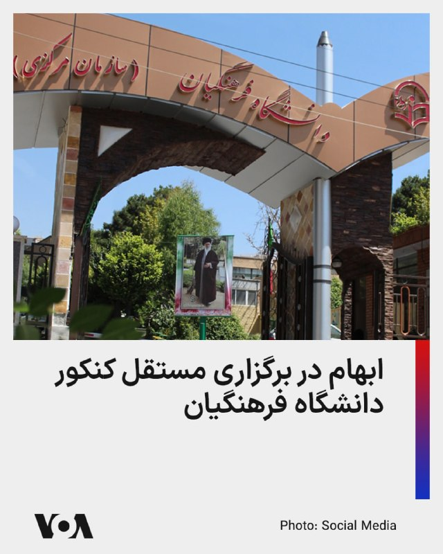
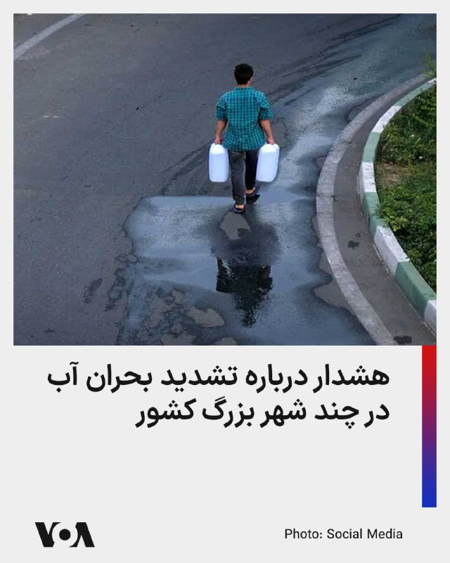
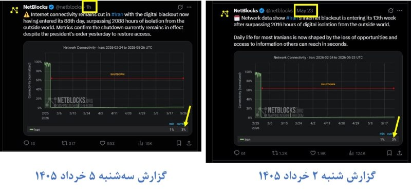
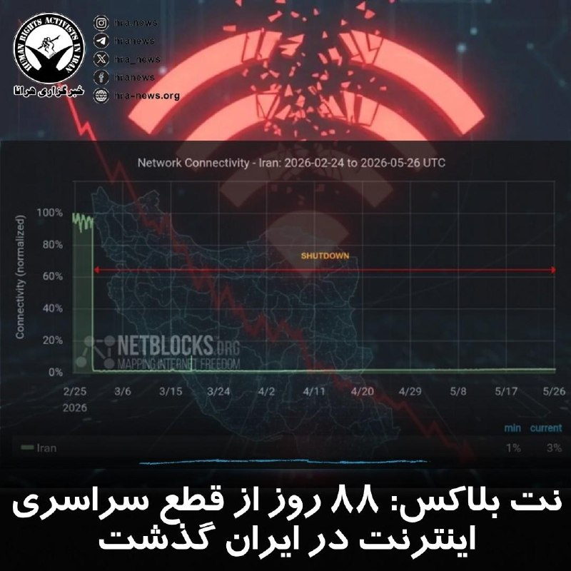
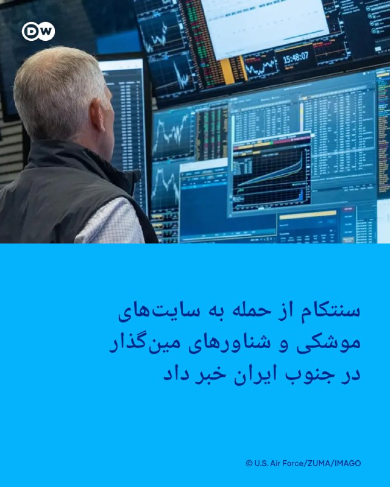
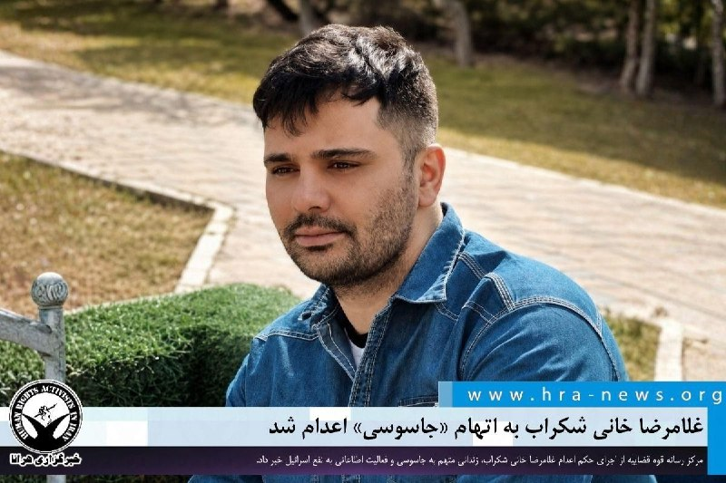
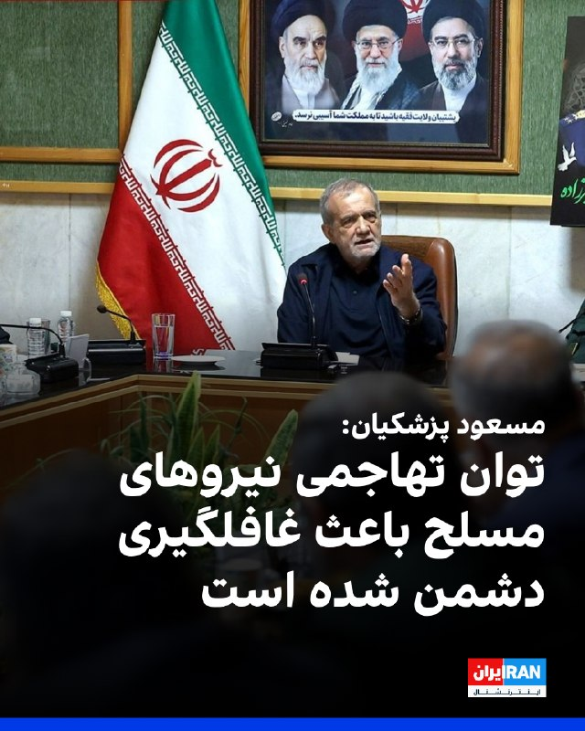

# خواننده تلگرام

<!-- TOP_NAV START -->

<a href="https://github.com/ProAlit/aio-downloader/blob/main/telegram/content/archive_1.md" style="display:inline-block; padding:6px 12px; margin:0 4px; background-color:#2ea44f; color:white; text-decoration:none; border-radius:4px; font-weight:bold;">صفحه بعد</a>

<!-- TOP_NAV END -->

<!-- MSG START -->

---
📅 بروزرسانی: 1405/03/05 13:43
---

## VahidOOnLine — post 242257

  

علیرضا نوین، عضو کمیسیون عمران مجلس گفت: «آمریکا و اروپا از قوی‌تر شدن جمهوری اسلامی وحشت دارند.»
او افزود عرب‌هایی که برای «براندازی حکومت» و «تجزیه ایران» میلیاردها دلار هزینه کردند، حال بیش از دیگران از سرگیری جنگ واهمه دارند، چراکه می‌دانند چه چیزی در انتظارشان است.
‌🏁 🇬🇧 IranintlTV

🤖 @VahidOOnLine

## VahidOOnLine — post 242256

  

♦️علی باقری کنی، معاون دبیر شورای عالی امنیت ملی جمهوری اسلامی روز سه‌شنبه پنجم خرداد به روسیه سفر کرد.

رسانه‌های داخلی ایران تصویری از استقبال کاظم جلالی، سفیر جمهوری اسلامی در مسکو از باقری کنی را منتشر کرده‌اند.

به گزارش ایرنا «باقری برای شرکت در چهاردهمین کنفرانس بین‌المللی مقامات عالی امنیتی به مسکو عزیمت کرده و علاوه بر سخنرانی‌ در این کنفرانس، با تعدادی از مقامات سیاسی و امنیتی روسیه نیز دیدار خواهد بود.»
‌🇸🇦 Indypersian

🤖 @VahidOOnLine

## WithYashar — post 12544

معاون وزیر ارتباطات: دقایقی دیگر اولین دسترسی ها به اینترنت بین الملل ایجاد می شود و رفته رفته مرم شاهد بازگشایی تدریجی اینترنت خواهند بود و تا ۲۴ ساعت دیگر همه مردم به اینترنت بین الملل متصل می شوند./خبر آنلاین @withyashar

## WithYashar — post 12543

ادعای آسوشیتدپرس: ایالات متحده و ایران دیروز در مورد مسئله دارایی‌های بلوکه‌شده به تفاهم رسیدند.

میانجیگری قطر با موفقیت به تفاهم آمریکایی-ایرانی درباره «دارایی‌های بلوکه‌شده» منجر شد.
به احتمال زیاد ایالات متحده و ایران امروز توافقی را در مورد «دارایی‌های بلوکه‌شده» اعلام خواهند کرد.
@withyashar

## WithYashar — post 12542

  

ترامپ در تروث : «رئیسِ معامله‌گرها، به ترامپ اعتماد کنید»
@withyashar

## IranIntlTV — post 339072

  

علیرضا نوین، عضو کمیسیون عمران مجلس گفت: «آمریکا و اروپا از قوی‌تر شدن جمهوری اسلامی وحشت دارند.»
او افزود عرب‌هایی که برای «براندازی حکومت» و «تجزیه ایران» میلیاردها دلار هزینه کردند، حال بیش از دیگران از سرگیری جنگ واهمه دارند، چراکه می‌دانند چه چیزی در انتظارشان است.
https://iranintl.com/202605262526

## IranIntlTV — post 339071

  <a href="telegram/content/IranIntlTV_339071_1779790416.mp4" target="_blank">🎬 Download video</a>

قوه قضاییه جمهوری اسلامی اعلام کرد غلامرضا خانی شکرآب، زندانی سیاسی ۳۳ ساله، اعدام شده است. دستگاه قضایی جمهوری اسلامی اتهام این زندانی سیاسی را «همکاری اطلاعاتی و جاسوسی برای اسرائیل» اعلام کرد.
گفت‌وگو با رضا حاجی‌حسینی، روزنامه‌نگار
@iranintltv

## IranIntlTV — post 339070

  <a href="telegram/content/IranIntlTV_339070_1779790419.mp4" target="_blank">🎬 Download video</a>

یک شهروند با ارسال پیامی به ایران‌اینترنشنال درباره مذاکره آمریکا و جمهوری اسلامی می‌گوید: «بعد از این همه هزینه و فشار، آخرش دوباره توافق با جمهوری اسلامی؟ حالا که حکومت ضعیف شده، بهترین فرصت برای پایان این رژیم است. اگر آمریکا توافق کند، این یک شکست تاریخی برای آمریکاست.»

## FarsiVOA — post 218688

  

در حالی که یک مقام آموزش و پرورش می‌گوید کنکور دانشگاه فرهنگیان حدود یک ماه دیگر و به طور مستقل از کنکور سراسری برگزاری می‌شود، سازمان سنجش به عنوان مجری اصلی این آزمون، تصمیم‌گیری در این باره را رد کرد.

دبیر شورای‌ آموزش‌ و پرورش برگزاری این آزمون را در تاریخ ۱۱ تیرماه ۱۴۰۵ عنوان کرده، اما مدیر روابط عمومی سازمان سنجش می‌گوید تا کنون تصمیم جدیدی درباره تفکیک آزمون سراسری و آزمون دانشجو معلمان گرفته نشده است.

به گفته مسئولان سازمان سنجش، هرگونه تغییر در روند برگزاری آزمون‌های سراسری، پس از نهایی شدن تصمیمات به ‌صورت رسمی اطلاع‌رسانی خواهد شد.
@FarsiVOA

## FarsiVOA — post 218687

  

مسئولان حوزه مدیریت بحران آب نسبت به وضعیت منابع آبی در برخی از مهم‌ترین شهرهای کشور از جمله تهران، کرج، مشهد هشدار دادند.

رئیس مرکز ملی مدیریت بحران سازمان هواشناسی با بیان اینکه برخی بارش‌ها را در منطقه داشته ایم هشدار داد که این موضوع نتوانسته وضعیت آب در این شهرها را بهبود دهد.

احمد وظیفه با اشاره به اینکه شهرهای ساوه و اراک نیز در وضعیت تنش آبی قرار گرفته‌اند، اعلام کرد: تهران و کرج به دلیل استفاده از یک حوضه مشترک آبی در شرایط تنش و بحران قرار دارند.

در همین حال، تازه‌ترین آمار شرکت مدیریت منابع آب ایران نشان می‌دهد میزان پرشدگی برخی سدهای مهم کشور از جمله لار، دوستی، پانزده ‌خرداد، بارزو و ساوه به کمتر از ۱۰ درصد رسیده است؛ موضوعی که بر شدت نگرانی‌ها درباره آینده تأمین آب در این مناطق افزوده است
@FarsiVOA

## DW_Farsi — post 125156

🔶 بازگشت دومین گروه از زنان استرالیایی مرتبط با داعش به کشور

مقام‌های استرالیا امروز سه‌شنبه ۲۶ مه (۵ خرداد) به وقت محلی، اعلام کردند که بازگشت گروهی به این کشور، شامل هفت زن استرالیایی و ۱۲ کودک که با گروه تروریستی "دولت اسلامی" (داعش) مرتبط بوده‌اند، برنامه‌ریزی شده است. این دومین گروه استرالیایی خواهد بود که در ماه جاری یک اردوگاه پناهجویان در سوریه را ترک می‌کند.

تونی برک، وزیر کشور استرالیا، گفت که دولت در روند سفر آنها کمکی ارائه نمی‌کند و هر فردی که مرتکب جرمی شده باشد «می‌تواند انتظار داشته باشد که با تمام قدرت قانون روبه‌رو شود.»

برک در بیانیه‌ای گفت: «اینها افرادی هستند که تصمیم هولناک پیوستن به یک سازمان تروریستی خطرناک را گرفتند و کودکان خود را در وضعیتی غیرقابل توصیف قرار دادند.»

برک نگفته است که این گروه دوم چه زمانی وارد استرالیا خواهد شد. دفتر او نیز تاکنون به درخواست رویترز برای ارائه جزئیات بیشتر پاسخی نداده است.

بنگاه خبررسانی استرالیا گزارش داد که این افراد پنج‌شنبه گذشته اردوگاهی در شمال شرق سوریه را ترک کرده‌اند و ممکن است طی روزهای آینده وارد این کشور شوند.

@dw_farsi

## Persian_Trend_Official — post 15061

  <a href="telegram/content/Persian_Trend_Official_15061_1779790423.mp4" target="_blank">🎬 Download video</a>

✡️ارتش دفاعی اسرائیل: در طول شب، ارتش دفاعی اسرائیل بیش از ۱۰۰ سایت زیرساختی حزب‌الله و تروریست‌ها را در دره بقاع و سراسر جنوب لبنان هدف قرار داد.

در چندین حمله در دره بقاع، سایت‌های زیرساختی تروریستی هدف قرار گرفتند، از جمله یک مرکز ذخیره سلاح حزب‌الله.

در جنوب لبنان، بیش از ۹۰ مرکز ذخیره سلاح، مراکز فرماندهی، پست‌های دیده‌بانی و سایت‌های زیرساختی که توسط تروریست‌های حزب‌الله برای پیشبرد حملات علیه سربازان ارتش دفاعی و غیرنظامیان اسرائیلی استفاده می‌شد، هدف قرار گرفتند.

حملات شبانه در منطقه مشغره، چندین حمله در عرض چند ثانیه علیه سایت‌های زیرساختی حزب‌الله که فعالیت تروریستی در آن‌ها شناسایی شده بود، دیده می‌شود، در طول حمله تروریست‌ها از بین رفتند.

👩‍💻@PhantomDirective

🆔@persian_trend_official
پرشین ترند | متفاوت‌ترین کانال نظامی

## RadioFarda — post 157566

🔸وزرای امور خارجه ایالات متحده، هند، ژاپن و استرالیا روز سه‌شنبه پنجم خرداد در دهلی نو دیدار کردند تا در بحبوحه نگرانی‌های مشترک در مورد امنیت منطقه‌ای و نفوذ فزاینده چین، روند همکاری‌های چهارجانبه را احیا کنند.

🔸به گزارش رویترز مارکو روبیو، وزیر امور خارجه ایالات متحده در این نشست گفت که این چهار کشور «قابلیت‌های منحصر به فردی» برای مقابله با چالش‌های جهانی، از جمله امنیت انرژی، زنجیره‌های تأمین و آزادی ناوبری دارند و این امر تکرار درخواست‌های قبلی برای همکاری عملی‌تر است.

🔸این دیدار بین دیپلمات‌های ارشد این کشورها، پنی وانگ وزیر امور خارجه استرالیا، اس. جایشانکار وزیر امور خارجه هند، توشیمیتسو موتگی وزیر امور خارجه ژاپن و مارکو روبیو، وزیر امور خارجه ایالات متحده، سومین گردهمایی از این دست از سپتامبر ۲۰۲۴ است.

🔸این چهار کشور قرار بود سال گذشته اجلاسی در هند برگزار کنند، اما در بحبوحه تنش‌ها بین ترامپ و نارندرا مودی، نخست‌وزیر هند بر سر تعرفه‌های واشنگتن و سایر مسائل، این نشست برگزار نشد.

@RadioFarda

## IranianMinds — post 20785

🔴 سیتنا : معاون سیاست گذاری و برنامه‌ریزی توسعه فاوا و اقتصاد دیجیتال وزارت ارتباطات، در پی دستور رییس جمهور از بازگشایی تدریجی اینترنت تا دقایقی دیگر خبر داد و گفت دسترسی کامل مردم به اینترنت تا 24 ساعت آینده میسر می شود. @IranianMinds

## Dirty_Kids — post 390220

  

خاک تو سرتون فقط لب و دهنید

بریزید بیرون اعتراض کنید که این آتش بس قبول نیست و باید دوباره جنگ شه.
مطالبه "اعدام ظریف و روحانی " هم فک کنم یادتون رفته. اونم بی زحمت ترتیب اثر بدید

@Dirty_Kids 👻

## Hranews — post 113172

  

یدالله رحمانی، استاندار کهگیلویه و بویراحمد، با تاکید بر لزوم مدیریت مصرف آب در بخش‌های کشاورزی، شرب و صنعت اعلام کرد که براساس آمار آبفا، ۶۰۰ روستا در این استان با #تنش_آبی مواجه بودند که از این تعداد ۱۲۰ روستا از تنش آبی خارج شدند و برای ۴۸۰ روستای باقی‌مانده، باید برنامه زمان‌بندی دقیقی ارائه شود تا طی سال‌های ۱۴۰۵ و ۱۴۰۶، سالانه ۲۴۰ روستا به تفکیک شهرستان از تنش آبی خارج شوند.

↘️
@hranews_bot تماس ✉️ -  @Hranews  کانال هرانا 🆑

## alonews — post 122769

  <a href="telegram/content/alonews_122769_1779790427.webm" target="_blank">🎬 Download video</a>

👈پست جدید ترامپ راجب ایران در تروث سوشال

✅ @AloNews خبر جنگ

## alonews — post 122768

  <a href="telegram/content/alonews_122768_1779790427.webm" target="_blank">🎬 Download video</a>

🔴در قرنی زندگی می کنیم که مردگان ۱۴۰۰سال پیش برما حکومت می کنند

✅@AloNews

---
📅 بروزرسانی: 1405/03/05 13:33
---

## WithYashar — post 12541

  

ترامپ در تروث : توافق اوباما با ایران , مقدار عظیمی پول فرستاد تا خیانتِ برنامهٔ هسته‌ای را تأمین مالی کند.
@withyashar

## WithYashar — post 12540

معاون وزیر ارتباطات: دقایقی دیگر اولین دسترسی ها به اینترنت بین الملل ایجاد می شود و رفته رفته مرم شاهد بازگشایی تدریجی اینترنت خواهند بود و تا ۲۴ ساعت دیگر همه مردم به اینترنت بین الملل متصل می شوند./خبر آنلاین
@withyashar

## FarsiVOA — post 218686

  <a href="telegram/content/FarsiVOA_218686_1779789790.mp4" target="_blank">🎬 Download video</a>

لحظه رهگیری و سقوط موشک کروز روسی روی زمین تنیس در کی‌یف؛

ویدیوی منتشرشده در شبکه‌های اجتماعی، لحظه مستقیم رهگیری یک موشک کروز «خا-۱۰۱» روسیه را دقیقاً از بالای سر یک فیلم‌بردار در کی‌یف و سقوط آن بر روی زمین تنیس در همان نزدیکی نشان می‌دهد. این موشک پس از برخورد منفجر نشد و تنها سوخت آن در آتش سوخت.

حملات گسترده موشکی و پهپادی ارتش روسیه به مناطق مسکونی و اهداف غیرنظامی در کی‌یف، پایتخت اوکراین، در چند روز گذشته ادامه داشته است.
@FarsiVOA

## Dirty_Kids — post 390219

  <a href="telegram/content/Dirty_Kids_390219_1779789791.mp4" target="_blank">🎬 Download video</a>

دختر شایسته ی وین کانتی ایالت میشیگان🥴

یعنی خدیجه البنت الجنده‌ها رو ریختن تو میشیگان ها!

@Dirty_Kids 👻

## Dirty_Kids — post 390218

  

بادبان با همراهی شما 90 هزار نفری شد!
🎉

🛒به این مناسبت، قیمت سرویس‌ها تا گیگی 150 هزار تومان کاهش پیدا کرد! 
🚀

🎁 کد تخفیف خرید اول دوباره ریست شد و همه میتونن ازش استفاده کنن:
BadBan4k

💸 با این کد، 50 هزار تومان تخفیف روی اولین خریدت بگیر!

🔥و مهم‌تر از همه...
سیستم معرفی بادبان فعال‌تر از همیشه‌ست!
از تمام خریدهای کاربرانی که معرفی میکنی، 10% خریدشون رو پورسانت دائمی دریافت کن و موجودی کیف پولت رو افزایش بده 
💼

وقتی بادبان داری،
هیچ بادی مانع نیست… حتی وقتی اینترنت ملیه
⛵️
A5

🛡@BadBan_VPN | کانال 

🤖@BadBan_VPNBot | ربات 

📞@BadBan_VPNSupport | پشتیبانی

## Dirty_Kids — post 390217

  

امروز روزِ نود گرفتن از کسیه که روش کراشی.

@Dirty_Kids 👻

## Dirty_Kids — post 390216

معاون وزارت قطع ارتباطات از بازگشایی تدریجی اینترنت تا دقایقی دیگر خبر داد و گفت دسترسی کامل مردم به اینترنت تا ۲۴ ساعت آینده میسر می شود. بر اساس اعلام یک منبع مطلع، برخی سرویس‌ها و پیام‌رسان‌های بین‌المللی نیز به‌تدریج و در چارچوب فازهای بعدی بازگشایی شبکه، در دسترس کاربران قرار خواهند گرفت و در فاز اول بازگشایی قرار ندارند.

@Dirty_Kids 👻

## alonews — post 122767

  <a href="telegram/content/alonews_122767_1779789793.webm" target="_blank">🎬 Download video</a>

👈سیتنا: دستور وزیر ارتباطات برای اتصال اینترنت صادر شد؛ اتصال جهانی ایران از همین دقایق احیا می‌شود؛ اتصال کامل مردم تا 24 ساعت آینده 
🔴 معاون سیاست گذاری و برنامه‌ریزی توسعه فاوا و اقتصاد دیجیتال وزارت ارتباطات، در پی دستور رییس جمهور از بازگشایی تدریجی اینترنت…

---
📅 بروزرسانی: 1405/03/05 13:23
---

## VahidOOnLine — post 242255

  

♦️قیمت نفت خام در بازارهای جهانی روز سه‌شنبه پنجم خرداد و پس از دو روز کاهش پیاپی و پس از حملات آمریکا به اهداف نظامی جمهوری اسلامی در منطقه خلیج فارس، نزدیک به ۳/۵ درصد افزایش یافت.

قیمت هر بشکه نفت خام برنت دریای شمال صبح سه‌‌شنبه همزمان با بازگشایی بازارهای اروپایی به ۹۹.۴۶ دلار رسید. همزمان شاخص بورس‌های آسیایی و اروپایی هم تحت تاثیر نگرانی از آینده مبهم توافق تهران و واشنگتن، کاهش یافت.
‌🇸🇦 Indypersian

🤖 @VahidOOnLine

## WithYashar — post 12539

خبر خوب

## WithYashar — post 12538

## WithYashar — post 12537

داداش انرژی که واسه انتقاد از ادمای بی لول میزاری به جاش بیرون یه قهوه بزن یه چرخی بزن هوایی عوض کن بعد بیا اخبارتو چک کن به زندگیم برس ما ایرانی جماعت کلا ادعای فهمیدنمون میشه و تو همه چی میخوایم نظر بدیم
بخدا اروپایی من ندیدم بگه همه چی میدونم یعنی تو ۹۰درصد مواقع بدونن هم میگن اطلاعی ندارم اما ما کلا همه چی بلدیم کوتاهم نمیایم
برای همینه یا تند میریم یا کلا یه جا بی حرکت می ایستیم این خصوصیت

## DW_Farsi — post 125155

  

🔶 مجتبی خامنه‌ای: آمریکا دیگر نقطه امنی برای استقرار پایگاه در منطقه نخواهد داشت

همزمان با آغاز برگزاری مراسم حج رسانه‌های ایران صبح سه‌شنبه، پنجم خرداد، پیامی منتسب به مجتبی خامنه‌ای را منتشر کردند که در آن تهدید کرده است "آمریکا دیگر نقطه امنی برای استقرار پایگاه نظامی در منطقه نخواهد داشت".

رهبر جمهوری اسلامی بدون نام بردن از کشورها یا پایگاه‌های نظامی آمریکا مستقر در خاورمیانه گفته است که "ملت‌ها و سرزمین‌های منطقه، دیگر سپر پایگاه‌های آمریکایی نخواهند بود".

مجتبی خامنه‌ای همچنین با اشاره به اظهارات ده سال پیش پدرش، علی خامنه‌ای، در مورد نابودی اسرائیل هشدار داده است که اسرائیل "به مراحل پایانی عمر خود" نزدیک شده است و "۲۵ سال بعد از آن را نخواهد دید".

رهبر پیشین جمهوری اسلامی سال ۱۳۹۴ در یک سخنرانی مدعی شده بود که اسرائیل "تا ۲۵ سال دیگر در منطقه وجود نخواهد داشت". وبسایت علی خامنه‌ای این جمله را "مهمترین جمله رهبر" در آن سال انتخاب کرد و در پی آن، این شعار از آن پس در تبلیغات حکومتی متعدد به کار گرفته شد و یک تابلوی روزشمار با مضمون "نابودی اسرائیل" نیز در تهران نصب شد.

مجتبی خامنه‌ای پس از کشته شدن پدر، همسر و برخی دیگر از اعضای خانواده‌اش در حملات نهم اسفند آمریکا و اسرائیل به بیت رهبری، در انظار عموم دیده نشده است و تا کنون هیچ پیام صوتی یا تصویری نیز از منتشر نشده است.

غلامعلی حداد عادل، پدر همسر مجتبی خامنه‌ای، اواخر اردیبهشت در یک برنامه تلویزیونی در شبکه خبر، در پاسخ به مجری برنامه که از او خواسته بود تا به مجتبی خامنه‌ای سلام برساند، در واکنشی غیرمنظره گفته بود: «من هم از همین طریق صدا و سیما سلام شما را به ایشان منتقل می‌کنم و امیدوارم برنامه ما را ببینند.»

@dw_farsi

## Persian_Trend_Official — post 15060

  <a href="telegram/content/Persian_Trend_Official_15060_1779789189.webm" target="_blank">🎬 Download video</a>

📰اورشلیم پست:«مذاکرات بین ایران و ایالات متحده کند شده است؛ میانجی‌ها به وال‌استریت ژورنال گفتند که بحث‌ها درباره برنامه هسته‌ای ایران و کاهش تحریم‌ها، روند مذاکرات را متوقف کرده است.»

👩‍💻@PhantomDirective

🆔@persian_trend_official
پرشین ترند | متفاوت‌ترین کانال نظامی

## alonews — post 122766

  <a href="telegram/content/alonews_122766_1779789190.webm" target="_blank">🎬 Download video</a>

👈وزارت خارجه چین: ما همواره از دستیابی به راه‌حلی صلح‌آمیز برای پرونده هسته‌ای ایران از طریق گفت‌وگو و مذاکره حمایت کرده‌ایم.

🔴امیدواریم که طرف‌های مرتبط در مذاکرات ایران به راه‌حلی دست یابند که نگرانی‌های مشروع همه را مد نظر قرار دهد.

🔴ما آماده‌ایم تا در حل سیاسی و دیپلماتیک پرونده هسته‌ای ایران به نقش سازنده خود ادامه دهیم

✅ @AloNews خبر جنگ

## alonews — post 122765

  <a href="telegram/content/alonews_122765_1779789190.webm" target="_blank">🎬 Download video</a>

👈سیتنا: دستور وزیر ارتباطات برای اتصال اینترنت صادر شد؛ اتصال جهانی ایران از همین دقایق احیا می‌شود؛ اتصال کامل مردم تا 24 ساعت آینده

🔴 معاون سیاست گذاری و برنامه‌ریزی توسعه فاوا و اقتصاد دیجیتال وزارت ارتباطات، در پی دستور رییس جمهور از بازگشایی تدریجی اینترنت تا دقایقی دیگر خبر داد و گفت: دسترسی کامل مردم به اینترنت تا 24 ساعت آینده میسر می شود.

✅ @AloNews خبر جنگ

## alonews — post 122764

  <a href="telegram/content/alonews_122764_1779789190.webm" target="_blank">🎬 Download video</a>

👈گفت‌وگوی پزشکیان با رئیس جمهور عراق درباره تنش‌ها در منطقه

🔴دو طرف بر اهمیت توقف جنگ و پایان دادن به تنش‌ها در منطقه از طریق گفت‌وگو و دیپلماسی تأکید کردند.

🔴پزشکیان و آمیدی همچنین بر ضرورت ترجیح زبان تفاهم به‌منظور تقویت امنیت و ثبات در منطقه توافق داشتند

✅ @AloNews خبر جنگ

## alonews — post 122763

  <a href="telegram/content/alonews_122763_1779789191.mp4" target="_blank">🎬 Download video</a>

👈ارتش اسرائیل : دیشب بیشتر از ۱۰۰ موضع و نیروهای حزب‌الله رو تو دره بقاع و جنوب لبنان هدف حمله قرار دادیم

✅ @AloNews خبر جنگ

---
📅 بروزرسانی: 1405/03/05 13:13
---

## VahidOOnLine — post 242254

  

فاطمه مهاجرانی، سخنگوی دولت در نشست خبری خود گفت: «بدیهی است که در شرایطی که در بسیاری از کشورها شاهد افزایش قیمت‌ها هستیم، حجم افزایش قیمت‌ها وجود دارد. اما تاکید می‌کنم تلاش دولت بر این است که قدرت خرید مردم تا حد امکان بالا برود و افزایش یابد.»

او ادامه داد: «هیچ موضوعی راجع به عدد و رقم مطرح نشده ولی این موضوع مطرح شده که باید میزان تولید را مدیریت کنیم.»

او افزود: «در طول جنگ گذشته و جدید آسیب‌هایی دیدیم که کتمان نمی‌کنیم. حدود ۱۰۰ میلیون لیتر در روز ظرفیت تولید بنزین داریم.»
iranintl
‌🏁 🇬🇧 IranintlTV

🤖 @VahidOOnLine

## VahidOOnLine — post 242253

  

خبرگزاری تسنیم، وابسته به سپاه پاسداران نوشت: «سفر محمدباقر قالیباف به قطر با هدف پیگیری آزادسازی بخشی از منابع ارزی انجام شده است.»

تسنیم به نقل از یک منبع نزدیک به تیم مذاکره‌کننده نوشت: «در پیش‌نویس یادداشت تفاهم ۱۴ بندی، آزادسازی ۲۴ میلیارد دلار از منابع بلوکه‌شده پیش‌بینی شده و تهران خواستار دسترسی به ۱۲ میلیارد دلار آن همزمان با اعلام تفاهم است.»

بر اساس گزارش تسنیم قرار است باقی این مبلغ ظرف ۶۰ روز منتقل شود و سفر قالیباف نیز برای هماهنگی درباره نحوه اجرای این مرحله و رفع موانع انجام شده است.

تسنیم به نقل از یک منبع دیگر درباره سخنان سخنگوی وزارت خارجه قطر درباره ندادن پول برای ضمانت تفاهم تهران و واشینگتن نوشت: «منابع مورد بحث در دوحه متعلق به جمهوری اسلامی است و ارتباطی با ضمانت توافق ندارد و تهران با توجه به تجربه‌های گذشته، با سخت‌گیری این روند را دنبال می‌کند.

گزارش تسنیم در حالی است که پیش از این، خبرگزاری صداوسیما وجود تفاهم‌نامه‌ای ۱۴ بندی را تکذیب کرده بود.
‌🏁 🇬🇧 IranintlTV

🤖 @VahidOOnLine

## WithYashar — post 12536

سپاه: حق پاسخ به حمله دیشب امریکایی رو برای خود محفوظ نگه میداریم
@withyashar

## mwarmonitor — post 9733

🔴ارتش اسرائیل (IDF) به ساکنان شهر نباتیه در جنوب لبنان هشدار تخلیه صادر کرد و از آن‌ها خواست فوراً منطقه را ترک کرده و به شمال رودخانه زهرانی منتقل شوند.

🔸در این هشدار، ارتش اسرائیل اعلام کرده است که این اقدام به دلیل نقض آتش‌بس از سوی حزب‌الله انجام شده و به ساکنان هشدار داده شده که افراد نزدیک به مواضع این گروه در معرض خطر قرار دارند.

@mwarmonitor

## DEJradio — post 4973

⭕️ قطر پیشنهاد ۱۲ میلیارد دلاری به جمهوری اسلامی را نادرست خواند

سخنگوی وزارت امور خارجهٔ قطر گزارش‌ها دربارهٔ پیشنهاد دوازده میلیارد دلاری دوحه به جمهوری اسلامی را برای نهایی شدن توافق با آمریکا «کاملا بی‌اساس» خواند.
ماجد الانصاری مدعی شد این روایت‌ها با هدف «برهم زدن توافق و تضعیف تلاش‌های دیپلماتیک» منتشر می‌شود.
خبرگزاری حکومتی تسنیم، گزارش داد جمهوری اسلامی در مذاکرات، بر آزادسازی بخشی از پول‌های بلوکه‌شدهٔ خود اصرار کرده است.
اخباری در مورد موافقت قطر با اهدای ۱۲ میلیارد دلار پول با پوشش وام، به جمهوری اسلامی منتشر شده است.
روز دوشنبه محمدباقر قالیباف، عباس عراقچی و رئیس کل بانک مرکزی جمهوری اسلامی سفری از پیش اعلام نشده به دوحه انجام دادند.
رویترز گزارش داد این سفر با موضوع احتمال آزادسازی دارایی‌های مسدودشدهٔ جمهوری اسلامی در چارچوب توافق احتمالی انجام شد.

#خبر #دژ #قطر #مذاکرات
@DEJradio

## IranIntlTV — post 339069

  

فاطمه مهاجرانی، سخنگوی دولت در نشست خبری خود گفت: «بدیهی است که در شرایطی که در بسیاری از کشورها شاهد افزایش قیمت‌ها هستیم، حجم افزایش قیمت‌ها وجود دارد. اما تاکید می‌کنم تلاش دولت بر این است که قدرت خرید مردم تا حد امکان بالا برود و افزایش یابد.»

او ادامه داد: «هیچ موضوعی راجع به عدد و رقم مطرح نشده ولی این موضوع مطرح شده که باید میزان تولید را مدیریت کنیم.»

او افزود: «در طول جنگ گذشته و جدید آسیب‌هایی دیدیم که کتمان نمی‌کنیم. حدود ۱۰۰ میلیون لیتر در روز ظرفیت تولید بنزین داریم.»
iranintl.com/202605263927

## Persian_Trend_Official — post 15058

ورود معاون دبیر شعام به مسکو

باقری برای شرکت در چهاردهمین کنفرانس بین‌المللی مقامات عالی امنیتی به مسکو عزیمت کرده و علاوه بر سخنرانی‌ در این کنفرانس، با تعدادی از مقامات سیاسی و امنیتی روسیه نیز دیدار خواهد بود.

👩‍💻@PhantomDirective

🆔@persian_trend_official
پرشین ترند | متفاوت‌ترین کانال نظامی

## Persian_Trend_Official — post 15057

  <a href="telegram/content/Persian_Trend_Official_15057_1779788581.mp4" target="_blank">🎬 Download video</a>

صحبت های گویر وزیر امنیت ملی اسرائیل درباره حملات حزب‌الله:

از نخست‌وزیر نتانیاهو می‌خواهم: با ترامپ تماس بگیر، پیش او برو، روی میز جلویش بکوب و به وضوح اعلام کن که دولت اسرائیل حاضر نیست — حاضر نیست این را بپذیرد، حاضر نیست این را تحمل کند.

👩‍💻@PhantomDirective

🆔@persian_trend_official
پرشین ترند | متفاوت‌ترین کانال نظامی

## IranianMinds — post 20784

  

🔴 سیتنا :

معاون سیاست گذاری و برنامه‌ریزی توسعه فاوا و اقتصاد دیجیتال وزارت ارتباطات، در پی دستور رییس جمهور از بازگشایی تدریجی اینترنت تا دقایقی دیگر خبر داد و گفت دسترسی کامل مردم به اینترنت تا 24 ساعت آینده میسر می شود.

@IranianMinds

## IranianMinds — post 20783

  

🔴 نت بلاکس :

قطعی اینترنت در ایران وارد ۸۸ امین روز خودش شد و با وجود دستور رئیس جمهور هنوز هم تغییری در سطح دسترسی دیده نمیشه.

@IranianMinds

## IranianMinds — post 20782

❌خودم عضو شدم ۵۰۰ تومان گرفتم
نیازی هم به واریز نیست 
😍

🌐 Winro.io

## IranianMinds — post 20781

  <a href="telegram/content/IranianMinds_20781_1779788584.webm" target="_blank">🎬 Download video</a>

🚨 اگر همین الان توی سایت #وینرو عضو بشی 
🤩
🤩
🤩 هزار تومان شارژ رایگان میگیری
❕

✅ من خودم عضو شدم بدون واریز ۵۰۰ تومان گرفتم باهاش فوتبال پیش بینی کردم پولم شد ۲ میلیون 
❕

💚خیلی راحت هم برداشت کردم کل پولم رو 
💵

💳 پرداخت مستقیم و سریع بدون واسطه، بدون دردسر، واریز و برداشت در سریع‌ترین زمان ممکن

🔴این فرصت محدود رو از دست ندید:

🌐 Winro.io

🌐 Winro.io
کانال بونوس های رایگان r5

📱 @winro_io

## alonews — post 122762

  <a href="telegram/content/alonews_122762_1779788585.webm" target="_blank">🎬 Download video</a>

👈 دادستان تهران: ۱۳ مدیر شرکت‌های پتروشیمی به دلیل عدم رفع تعهدات ارزی احضار شدند

✅ @AloNews خبر جنگ

---
📅 بروزرسانی: 1405/03/05 13:03
---

## VahidOOnLine — post 242252

  <a href="telegram/content/VahidOOnLine_242252_1779787994.mp4" target="_blank">🎬 Download video</a>

♦️مارکو روبیو، وزیر امور خارجه ایالات متحده روز سه‌شنبه پنجم خرداد با تاکید بر بازگشایی تنگه هرمز «به هر طریقی» گفت هیچ کشوری در جهان، ازجمله چین و روسیه با نظام پرداخت عوارض برای عبور از این شاهراه حیاتی موافق نیستند.

این سخنان ساعاتی پس از حمله دوباره نظامیان آمریکا به اهداف نظامی جمهوری اسلامی در منطقه خلیج فارس و تنگه هرمز بیان شد.

بازگشایی تنگه هرمز یکی از موضوعات کلیدی در مذاکرات پایان جنگ میان تهران و واشنگتن است. جمهوری اسلامی در هفته نخست آغاز جنگ در اسفندماه سال گذشته، تنگه هرمز را بست. با وجود اعلام آتش‌بس و محاصره دریایی بنادر ایران، عبور و مرور کشتی‌ها و نفتکش‌ها از این تنگه همچنان به ندرت انجام می‌شود.
‌🇸🇦 Indypersian

🤖 @VahidOOnLine

## VahidOOnLine — post 242251

  

عرفان صدیق، سفیر بریتانیا در عراق، در مصاحبه با کانال یک عراق، سازمان حشدالشعبی و گروه‌های مسلح وابسته به جمهوری اسلامی را «مافیا» خواند.

او تاکید کرد این گروه‌ها با سوءاستفاده از ضعف دولت عراق، قراردادهای شرکت‌های بریتانیایی با بغداد را تصاحب کرده‌اند.
iranintl
‌🏁 🇬🇧 IranintlTV

🤖 @VahidOOnLine

## WithYashar — post 12535

@withyashar جنبش صهیونیسم

## mwarmonitor — post 9732

🔸دادستان‌های اسرائیل در حال بررسی طرح اتهامات کیفری علیه رئیس دفتر بنیامین نتانیاهو، یعنی تساحی برافرمان هستند.

🔹این اتهامات احتمالی شامل تقلب، نقض اعتماد و مانع‌تراشی در روند عدالت است و به نشت ادعایی یک سند اطلاعاتی فوق‌محرمانه به روزنامه آلمانی بیلد مرتبط می‌شود.

@mwarmonitor

## pm_afshaa — post 91521

سپاه: حق پاسخ به حمله دیشب امریکایی رو برای خود محفوظ نگه میداریم

💧 Rainbet.com the #1 Non-KYC Crypto Casino & Sportsbook @rainbetcom

😁 @Pm_Afshaa

## pm_afshaa — post 91520

🔴کانال 14 اسراییل:
مجتبی خامنه‌ای، پسر رهبر ایران، روز سه‌شنبه تهدیدی مستقیم و شدید علیه اسرائیل و ایالات متحده مطرح کرد. رهبر ایران گفت: «اسرائیل به «پایان» موجودیت خود نزدیک می‌شود.» او همچنین تهدیدی علیه واشنگتن اضافه کرد: {کشورها و سرزمین‌های منطقه دیگر به عنوان سپری برای پایگاه‌های آمریکا عمل نخواهند کرد. ایالات متحده روز به روز از جایگاهی که در گذشته داشت، فاصله می‌گیرد}

💧 Rainbet.com the #1 Non-KYC Crypto Casino & Sportsbook @rainbetcom

😁 @Pm_Afshaa

## DEJradio — post 4972

⭕️ روبیو: پیش از بررسی راه‌های دیگر علیه جمهوری اسلامی هنوز به دیپلماسی فرصت داده‌ایم

مارکو روبیو، وزیر امور خارجهٔ آمریکا، روز سه‌شنبه گفت واشینگتن پیش از بررسی «راه‌های دیگر» علیه رژیم حاکم بر ایران، به دیپلماسی کاملا فرصت می‌دهد.
به گفتهٔ روبیو دستیابی به توافق اولیه با تهران ممکن است چند روز طول بکشد.
او گفت دربارهٔ پیش‌نویس توافق «اتفاق‌نظر» وجود دارد، اما اختلاف بر سر برخی واژه‌ها و جملات هنوز ادامه دارد.
مارکو روبیو به‌سان دونالد ترامپ تأکید کرد یا یک توافق خوب رخ می‌دهد یا توافقی در کار نیست.

#مارکو_روبیو #خبر #دژ
@DEJradio

## IranIntlTV — post 339067

  

خبرگزاری تسنیم، وابسته به سپاه پاسداران نوشت: «سفر محمدباقر قالیباف به قطر با هدف پیگیری آزادسازی بخشی از منابع ارزی انجام شده است.»

تسنیم به نقل از یک منبع نزدیک به تیم مذاکره‌کننده نوشت: «در پیش‌نویس یادداشت تفاهم ۱۴ بندی، آزادسازی ۲۴ میلیارد دلار از منابع بلوکه‌شده پیش‌بینی شده و تهران خواستار دسترسی به ۱۲ میلیارد دلار آن همزمان با اعلام تفاهم است.»

بر اساس گزارش تسنیم قرار است باقی این مبلغ ظرف ۶۰ روز منتقل شود و سفر قالیباف نیز برای هماهنگی درباره نحوه اجرای این مرحله و رفع موانع انجام شده است.

تسنیم به نقل از یک منبع دیگر درباره سخنان سخنگوی وزارت خارجه قطر درباره ندادن پول برای ضمانت تفاهم تهران و واشینگتن نوشت: «منابع مورد بحث در دوحه متعلق به جمهوری اسلامی است و ارتباطی با ضمانت توافق ندارد و تهران با توجه به تجربه‌های گذشته، با سخت‌گیری این روند را دنبال می‌کند.

گزارش تسنیم در حالی است که پیش از این، خبرگزاری صداوسیما وجود تفاهم‌نامه‌ای ۱۴ بندی را تکذیب کرده بود.
https://iranintl.com/202605261877

## IranIntlTV — post 339066

  

عرفان صدیق، سفیر بریتانیا در عراق، در مصاحبه با کانال یک عراق، سازمان حشدالشعبی و گروه‌های مسلح وابسته به جمهوری اسلامی را «مافیا» خواند.

او تاکید کرد این گروه‌ها با سوءاستفاده از ضعف دولت عراق، قراردادهای شرکت‌های بریتانیایی با بغداد را تصاحب کرده‌اند.
iranintl.com/202605261680

## FarsiVOA — post 218685

  

سارا سپهری، شهروند بهایی ساکن شیراز، با گذشت بیش از یک ماه از زمان بازداشت همچنان در زندان عادل‌آباد این شهر به ‌صورت بلاتکلیف نگهداری می‌شود.

براساس گزارش هرانا، این شهروند بهایی در دوران بازداشت با مشکلات جسمانی از جمله خونریزی معده و تشدید بیماری چشمی مواجه شده است.

هرانا به نقل از یک منبع نزدیک به خانواده سپهری نوشته است که به دلیل فشار بازجویی‌های طولانی ‌مدت و عدم دسترسی به دارو و درمان مناسب، وضعیت جسمی و روحی او رو به وخامت رفته است.

این منبع تأکید کرده است که سارا سپهری نیازمند رسیدگی فوری پزشکی و اعزام به مراکز درمانی خارج از زندان است.

سارا سپهری در فروردین‌ماه امسال در منزل خود در شیراز توسط نیروهای امنیتی بازداشت و سپس به زندان عادل‌آباد منتقل شد. در جریان این بازداشت، محل سکونت او و مادرش نیز مورد بازرسی قرار گرفته و برخی وسایل شخصی و دیجیتال ضبط شده است.

تا این لحظه، دلیل بازداشت و اتهامات مطرح‌شده علیه این شهروند بهائی به‌طور رسمی اعلام نشده است.
@FarsiVOA

## Persian_Trend_Official — post 15056

  

🔹ارتش دفاعی اسرائیل از تمام شهروندان شهر نبطیه(دومین شهر بزرگ جنوب لبنان) خواست به طور کامل شهر را تخلیه کنند.

👩‍💻@PhantomDirective

🆔@persian_trend_official
پرشین ترند | متفاوت‌ترین کانال نظامی

## Persian_Trend_Official — post 15055

⭕️ علی‌حسین قاضی‌زاده:

ایران در ۴۰ روز جنگ، هیچ پناهنده‌ای به جهان تحمیل نکرد و از این حیث رکوردی برجا گذاشت.
اگر توافقی امضا شود، سیل مهاجرت و پناهندگی به راه می‌افتد و رکوردی تازه‌ای در مهاجرت پس از جنگ برجا می‌گذارد.
اگر غربی‌ها تعلل کنند، چند ماه دیگر می‌فهمند، بهای زایل کردن امید یک ملت، فراتر از آنی است که از آن مصون بمانند.

📝 Nick

📌 @persian_trend_official
پرشین ترند | متفاوت‌ترین کانال نظامی

## Persian_Trend_Official — post 15054

  

ارتش اسرائیل(IDF): گزارش اولیه - آژیرهای خطر در مورد نفوذ یک پهپاد حزب‌الله در منطقه نتوآ به صدا درآمدند. جزئیات تکمیلی به زودی.......

## RadioFarda — post 157565

  

🔸سپاه پاسداران انقلاب اسلامی روز سه‌شنبه پنجم خرداد مدعی شد که یک پهپاد آمریکایی را «ساقط» کرده و به سوی چند پهپاد آمریکایی دیگر که وارد حریم هوایی کشور شده بودند، «شلیک» کرده است.

🔸در بیانیه سپاه آمده بعد از اینکه هواپیماهای نظامی آمریکا وارد حریم هوایی ایران در منطقه خلیج فارس شدند، یگان‌های پدافند هوایی سپاه «یک پهپاد ام‌.کیو ۹ را شناسایی و سرنگون کردند».

🔸در این بیانیه آمده است که نیروهای سپاه «همچنین به سوی یک پهپاد آر.کیو۴ و یک جنگنده نفوذی اف۳۵ شلیک کردند».

🔸در این بیانیه به زمان وقوع این حوادث اشاره‌ای نشده است.

🔸این بیانیه پس از آن منتشر می‌شود که ستاد فرماندهی مرکزی آمریکا، سنتکام، اعلام کرد که ارتش ایالات متحده روز دوشنبه در جنوب ایران حملاتی را علیه اهدافی «از جمله قایق‌هایی که در تلاش برای کارگذاری مین بودند و همچنین سایت‌های پرتاب موشک» انجام داده است.

🔸رسانه‌های ایران بامداد سه‌شنبه گزارش دادند که «جنگنده‌های آمریکایی چند شناور ایرانی را در جنوب جزیره لارک هدف قرار دادند» و از کشته شدن دست‌کم سه تن نیز در این حمله خبر دادند.

@RadioFarda

## BBCPersian — post 282091

🔻مقام بانک مرکزی اروپا می‌گوید که حتی در صورت توافق صلح با ایران، این نهاد باید نرخ بهره را افزایش دهد

ایزابل اشنابل، عضو هیئت‌مدیره بانک مرکزی اروپا، گفته است که این نهاد باید ماه آینده نرخ‌ بهره را افزایش دهد، حتی اگر مذاکرات جاری صلح با ایران به توافق منجر شود.

بانک مرکزی اروپا طی یک سال گذشته نرخ‌ بهره را بدون تغییر حفظ کرده است، اما ماه گذشته به‌دلیل جهش شدید هزینه‌های انرژی و افزایش تورم به سطحی بسیار بالاتر از هدف دو درصدی، گزینه افزایش نرخ بهره را بررسی کرد.

در همین حال، چندین مقام سیاست‌گذار نیز بر ضرورت اقدام تأکید کرده‌اند.

خانم اشنابل که از او به‌عنوان یکی از گزینه‌های احتمالی جانشینی کریستین لاگارد در ریاست بانک مرکزی اروپا در سال آینده میلادی یاد می‌شود، گفت این نهاد ممکن است از «نقطه بی‌بازگشت» عبور کرده باشد چرا که زیرساخت‌های انرژی نیز در جریان جنگ علیه ایران آسیب دیده‌اند.

او در گفت‌وگو با خبرگزاری رویترز اظهار داشت: «با توجه به ابعاد گسترده و ماندگاری شوک انرژی، فکر می‌کنم افزایش نرخ بهره در ماه ژوئن ضروری خواهد بود.»

https://bbc.in/4u071Sq
@BBCPersian

## BBCPersian — post 282090

  

🔻مجتبی خامنه‌ای، رهبر جمهوری اسلامی ایران، در پیامی کتبی که از تلویزیون دولتی نیز پخش شد، گفته است که کشورهای منطقه دیگر سپری برای پایگاه‌های آمریکا نخواهند بود.

مجتبی خامنه‌ای که از زمان آغاز به کارش در اسفند تاکنون در انظار عمومی ظاهر نشده، در پیامی کتبی به مناسبت برگزاری مراسم حج گفت: «آنچه مسلم است، عقربهٔ زمان به عقب برنمی‌گردد و ملت‌ها و سرزمین‌های منطقه دیگر سپر پایگاه‌های آمریکایی نخواهند بود.»

او همچنین در این پیام آورده است: «آمریکا علاوه بر آنکه دیگر نقطه امنی برای شرارت و استقرار پایگاه نظامی در منطقه نخواهد داشت، روزبه‌روز از وضع سابق خود فاصله می‌گیرد.»

آقای خامنه‌ای در بخش دیگری از پیامش به اسرائیل هم اشاره کرده است: «رژیم متزلزل صهیونی و غدهٔ سرطانی اسرائیل به مراحل پایانی عمر منحوس خود نزدیک شده است»

او در این پیام کتبی با یادآوری اظهارات پدرش در ۱۰ سال پیش افزود که اسرائیل «۲۵ سال بعد از آن تاریخ را نخواهد دید.»

📸 Reuters

https://bbc.in/4u071Sq
@BBCPersian

## alonews — post 122761

  <a href="telegram/content/alonews_122761_1779788004.webm" target="_blank">🎬 Download video</a>

👈ارتش اسرائیل (IDF) هشدار تخلیه فوری در شهر النبطیه صادر کرده است

✅ @AloNews خبر جنگ

---
📅 بروزرسانی: 1405/03/05 12:52
---

## WithYashar — post 12534

منبعی آگاه به «اتاق جنگ با یاشار» گفت که در شروط توافق این مورد تأکیید شده که ترامپ باید ختنه کند.🤣
@withyashar

## pm_afshaa — post 91519

  

غلامرضا خانی شکراب از معترضین دی ماه ، امروز با اذان صبح اعدام شد

💧 Rainbet.com the #1 Non-KYC Crypto Casino & Sportsbook @rainbetcom

😁 @Pm_Afshaa

## DEJradio — post 4971

⭕️ ذخایر اورانیوم جمهوری اسلامی ممکن است زیر نظارت آژانس اتمی نابود شود

دونالد ترامپ، رئیس‌ جمهوری آمریکا گفت اورانیوم غنی‌شده در ایران احتمالا به آمریکا منتقل و نابود می‌شود.
او گفت در غیر این صورت ممکن است با هماهنگی جمهوری اسلامی، این ذخایر در محل یا در یک مکان مورد توافق دیگر، از بین برود.
ترامپ در تروث سوشال نوشت این روند زیر نظر آژانس بین‌المللی انرژی اتمی یا نهادی مشابه انجام می‌گیرد.
باراک راوید، خبرنگار ارشد اکسیوس، موضع تازهٔ ترامپ را عقب‌نشینی واشینگتن از خواستهٔ پیشین برای خروج کامل ذخایر اورانیوم از ایران عنوان کرد.
در همین راستا بنیامین نتانیاهو، نخست‌وزیر اسرائیل گفته است بدون خروج ذخایر اورانیوم غنی‌شده از ایران، جنگ پایان نمی‌یابد.

#خبر #ترامپ #اورانیوم
@DEJradio

## Shin_Persian — post 6237

  

↩️ Quoted tweet: DefenceGeek 🇬🇧 ✓ @DefenceGeek Tue, 26 May 2026 09:11:22 UTC Summary of overnight events in CENTCOM --- Operation EPIC FURY / Project FREEDOM --- Ok so not 100% sure if this is all in the right order, but from what I've gathered: - IRGC…

## Shin_Persian — post 6236

↩️ Quoted tweet:
DefenceGeek 🇬🇧 ✓ @DefenceGeek
Tue, 26 May 2026 09:11:22 UTC

Summary of overnight events in CENTCOM
--- Operation EPIC FURY / Project FREEDOM ---

Ok so not 100% sure if this is all in the right order, but from what I've gathered:

- IRGC boats in the gulf were identified approaching commercial shipping and/or trying to lay mines in the

↩️ توییت نقل‌قول شده — برای پاسخ، پست زیر را ببینید.

فارسی

خلاصه‌ای از حوادث شبانه در سنتکام (ستاد فرماندهی مرکزی ایالات متحده - CENTCOM)
--- عملیات خشم حماسی / پروژه آزادی ---

بسیار خب، ۱۰۰٪ مطمئن نیستم که همه این‌ها به ترتیب درست باشند، اما طبق آنچه گردآوری کرده‌ام:

- قایق‌های سپاه پاسداران انقلاب اسلامی (IRGC) در خلیج [فارس] شناسایی شدند که در حال نزدیک شدن به کشتی‌های تجاری و/یا تلاش برای مین‌گذاری در

𝕏 · @shin_persian

## FarsiVOA — post 218684

  

رسانه‌های ایران پیامی منتسب به مجتبی خامنه‌ای که به عنوان رهبر جمهوری اسلامی معرفی شده منتشر کردند که در آن، تهدید شده که آمریکا دیگر «نقطه امنی برای استقرار پایگاه نظامی در منطقه نخواهد داشت».

در این پیام که روز سه‌شنبه پنجم خرداد منتشر شد، ادعا شده است: «عقربه زمان به عقب برنمی‌گردد و ملت‌ها و سرزمین‌های منطقه، دیگر سپر پایگاه‌های آمریکایی نخواهند بود.»

بیانیه منتسب به مجتبی خامنه‌ای چند ساعت پس از آن منتشر شد که نیروهای آمریکا به سایت‌های موشکی در جنوب ایران و قایق‌هایی که در حال کارگذاری مین بودند حمله کردند. همچنین این پیام در شرایطی است که تهران و واشنگتن درباره چارچوبی برای پایان دادن به جنگ گفت‌وگو می‌کنند.

در طول جنگ، چندین پایگاه آمریکا در خاورمیانه از سوی نیروهای جمهوری اسلامی و گروه‌های نیابتی‌اش هدف حمله قرار گرفت.

مجتبی خامنه‌ای از زمان معرفی به عنوان رهبر جمهوری اسلامی، به صورت عمومی ظاهر نشده و تنها بیانیه‌های کتبی منتشر کرده است. همچنین پس از گزارش‌ها درباره مجروح شدن او در حملات، گمانه‌زنی‌ها درباره وضعیت سلامتی‌اش افزایش یافته است.
@FarsiVOA

## FarsiVOA — post 218683

🔺دولت در مرز بحران سوخت؛ مهاجرانی: تولید روزانه ۱۰۰ میلیون لیتر باید مدیریت شود

▪️سخنگوی دولت جمهوری اسلامی می‌گوید ایران در جریان جنگ اخیر آسیب‌هایی دیده و این موضوع «قابل انکار نیست».

▪️او با اشاره به ظرفیت حدود ۱۰۰ میلیون لیتر تولید داخلی بنزین در روز تأکید کرد همین حجم در اختیار مردم قرار می‌گیرد و باید با «اصلاح الگوی مصرف» مدیریت شود. او افزود که «هیچ موضوعی درباره عدد و رقم قیمت بنزین در دولت مطرح نشده است.»

▪️گزارش‌های داخلی ظرفیت تولید بنزین را حدود ۱۰۵ تا ۱۱۰ میلیون لیتر و مصرف روزانه را حدود ۱۳۰ تا ۱۳۵ میلیون لیتر برآورد کرده‌اند؛ یعنی شکافی حدود ۲۰ تا ۲۵ میلیون لیتر در روز که معمولاً با واردات یا فشار بر مصرف جبران می‌شود.

⬇️ بیشتر بخوانید:
https://ir.voanews.com/a/8154029.html

## RadioFarda — post 157564

  

🔸دستگاه قضایی جمهوری اسلامی روز سه‌شنبه پنجم خرداد از اعدام یک شهروند دیگر به اتهام جاسوسی برای اسرائیل خبر داد.

🔸خبرگزاری قوه قضاییه هویت فرد اعدام‌شده را غلامرضا خانی شکراب معرفی و ادعا کرده است که او «سرشبکهٔ سرویس جاسوسی اسرائیل» بوده است.

🔸گزارش دستگاه قضایی اشاره‌ای به تاریخ بازداشت و محاکمهٔ متهم نکرده و در عین حال وی را «از اراذل و اوباش یکی از استان‌های کشور و دارای سوابق نزاع و شرارت» خوانده و ادعا کرده است که او «به دنبال جذب افراد و به‌کارگیری آن‌ها در داخل کشور برای اجرای اقدامات ضد امنیتی بوده است».

🔸از روند محاکمه این متهم گزارشی منتشر نشده و گزارش قوه قضاییه نیز مدارک و مستنداتی از اتهامات ارائه نداده است.

🔸دستگاه قضایی جمهوری اسلامی در ماه‌های اخیر به شکل تقریباً روزانه اقدام به اجرای احکام اعدام معترضان و یا افرادی می‌کند که آن‌ها را به همکاری با آمریکا و اسرائیل متهم می‌کند. برخی نهادهای حقوق‌بشری می‌گویند جمهوری اسلامی از اعدام برای ایجاد فضای ترس و به‌عنوان عامل سرکوب استفاده می‌کند.

@RadioFarda

## alonews — post 122760

  <a href="telegram/content/alonews_122760_1779787374.webm" target="_blank">🎬 Download video</a>

👈تسنیم به نقل از یک منبع آگاه نزدیک به تیم مذاکره کننده: طبق متن ۱۴ ماده ای یادداشت تفاهم، منابع بلوکه شده ایران باید در طول ‌مذاکرات آزاد شود که این مبلغ ۲۴ میلیارد دلار برآورد شده است.

🔴 ایران تاکید دارد که نصف این مبلغ باید با شروع اعلام یادداشت تفاهم در دسترس قرار گیرد و بقیه در طول ۶۰ روز منتقل شود.

🔴سفر قالیباف به قطر هم برای تفاهم درباره اجرایی‌سازی این مطالبه ایران و نحوه دسترسی به ۱۲ میلیارد دلار در گام اول و رفع موانع بوده است.

🔴 با توجه به تجربه تفاهم بر سر آزادسازی پول‌های ایران در کره جنوبی و قطر، تاکید بر این بود که مراحل اجرایی با دقت پیگیری شود تا این تجربه مجدد تکرار نشود. به همین دلیل با استفاده از تجربه نوبت قبل این سفر انجام شد تا اختلالی در دسترسی به این مبالغ پیش نیاید و از این جنبه سفر نتایج خوبی داشت.

🔴مذاکرات قطر در مجموع خوب بود و موجب پیشرفت در مذاکرات کلی شد. در این حال نباید فراموش کرد که آمریکا به عنوان یک طرف بدعهد شناخته می شود و از این جهت ایران با احتیاط فراوان به مسائل می نگرد.

🔴 همچنین یک منبع مطلع دیگر در واکنش به اظهارات سخنگوی وزارت خارجه قطر مبنی بر اینکه این کشور پولی برای ضمانت تفاهم‌نامه ایران و آمریکا نمی‌دهد گفت که این اظهارات قطری‌ها در کل اشتباه نیست چرا که منابع مورد گفت و گو در دوحه متعلق به ایران است و ربطی به ضمانت تفاهم ندارد و ایران به دلیل تجربه‌های قبلی با دقت‌نظر و سخت‌گیری کامل به دنبال بازگشت این منابع است

✅ @AloNews خبر جنگ

## alonews — post 122759

  <a href="telegram/content/alonews_122759_1779787374.mp4" target="_blank">🎬 Download video</a>

👈وزیر امنیت ملی اسرائیل بن گویر: اگر دولت لبنان کنترل حزب‌الله را ندارد، آنگاه سرزمین‌های جنوب لیتانی — و حتی جنوب زهرانی — باید به یک «منطقه امنیتی» برای دولت اسرائیل تبدیل شوند.

🔴ما باید برق را قطع کنیم، زیرساخت‌ها را نابود کنیم و به آن‌ها روشن کنیم: اگر تروریسم وجود دارد، شما رنج خواهید برد.

✅ @AloNews خبر جنگ

## alonews — post 122758

  <a href="telegram/content/alonews_122758_1779787376.webm" target="_blank">🎬 Download video</a>

👈وزیر دفاع طالبان به روسیه سفر کرد

✅ @AloNews خبر جنگ

---
📅 بروزرسانی: 1405/03/05 12:42
---

## VahidOOnLine — post 242250

  

علی نیکزاد، نایب‌رییس مجلس، گفت: «از آغاز جنگ نمایندگان تمایل داشتند جلسات صحن علنی برگزار شود اما نهادهای اطلاعاتی و امنیتی با این موضوع موافقت نکردند.»

او افزود: «جلسات مجلس در حال حاضر به‌صورت وبیناری برگزار می‌شود و در صورت فراهم شدن شرایط، نشست‌ها دوباره به شکل حضوری در صحن علنی برگزار خواهد شد.»

این در حالی است که از زمان آغاز جنگ در ۹ اسفند ۱۴۰۴، جلسات صحن علنی مجلس تعطیل شده و حتی انتخابات هیات رییسه در روز دوشنبه نیز در مکانی نامعلوم برگزار شده بود.
‌🏁 🇬🇧 IranintlTV

🤖 @VahidOOnLine

## WithYashar — post 12533

@withyashar ماجرای ری اکشن

## IranIntlTV — post 339065

  

🔻علیرضا دبیر، رییس فدراسیون کشتی در حاشیه رونمایی از سه کتاب گفت: «بروید تاریخ بخوانید، در تاریخ ایران به باسوادی امام و آقا نداشتیم، بسیار کتابخوان و باسواد بودند.» او همچنین درباره جنگ با آمریکا گفت: «ما با اینها جنگ داریم الان هم نشود بعد از جام جهانی می‌آیند.»

🔹دبیر در وصف کتابخوانی خود گفت: «ذهنم را با اطلاعات الکی پر نمی‌کنم، فضای مجازی را دنبال نمی‌کنم که وقتم گرفته نشود و همه به خاطر این کتاب هاست که خواندم.»

🔹او گفت: «من در ایام قهرمانی با دو دست زیر می‌گرفتنم و با دو دست زیر گرفتن را از تیمور لنگ یاد گرفتم. او با دو دست شمشیر می‌زد. این کتاب را می‌خواندم که با دو دست روی اسب شمشیر می‌زد.»

🔹رییس فدراسیون فوتبال با اعتراف به سرسپردگی خود به علی خامنه‌ای، رهبر جمهوری اسلامی، گفت: «شب به شب اخبار را می‌دیدم و آقا تکلیف را مشخص می‌کرد. نتیجه هم گرفتیم هر جا حرف گوش کردیم عاقبت به خیری بود هم در سیاست و هم در ورزش. من محو در آقا بودم، اما الان ولی فقیه و امام ما آقا مجتبی است.»

@iranintltvsport

## IranIntlTV — post 339063

  <a href="telegram/content/IranIntlTV_339063_1779786767.mp4" target="_blank">🎬 Download video</a>

گزارش‌های رسیده به ایران‌اینترنشنال از افزایش فشارهای امنیتی بر دانشجویان دانشگاه شریف در یک ماه اخیر حکایت دارد. بر اساس این گزارش‌ها، نزدیک به ۳۰ دانشجو به کمیته انضباطی احضار شدند. برای شش نفر حکم اخراج و برای شماری دیگر محرومیت چندساله از تحصیل در همه دانشگاه‌ها صادر شده است.
جزییات بیشتر با لیلا سعادتی، عضو تحریریه ایران‌اینترنشنال
@iranintltv

## IranIntlTV — post 339062

  

علی نیکزاد، نایب‌رییس مجلس، گفت: «از آغاز جنگ نمایندگان تمایل داشتند جلسات صحن علنی برگزار شود اما نهادهای اطلاعاتی و امنیتی با این موضوع موافقت نکردند.»

او افزود: «جلسات مجلس در حال حاضر به‌صورت وبیناری برگزار می‌شود و در صورت فراهم شدن شرایط، نشست‌ها دوباره به شکل حضوری در صحن علنی برگزار خواهد شد.»

این در حالی است که از زمان آغاز جنگ در ۹ اسفند ۱۴۰۴، جلسات صحن علنی مجلس تعطیل شده و حتی انتخابات هیات رییسه در روز دوشنبه نیز در مکانی نامعلوم برگزار شده بود.
https://iranintl.com/202605264769

## IranIntlTV — post 339061

  <a href="telegram/content/IranIntlTV_339061_1779786769.mp4" target="_blank">🎬 Download video</a>

بررسی‌های ایران‌اینترنشنال نشان می‌دهد جمهوری اسلامی در کمتر از ۷۰ روز، دست‌کم ۳۹ زندانی سیاسی را اعدام کرده است؛ از جمله ۱۵ نفر از بازداشت‌شدگان اعتراضات دی‌ماه ۱۴۰۴.
بیشترین احکام اعدام در استان‌های تهران و البرز اجرا شده است.
@iranintltv

## DW_Farsi — post 125154

  

📸 عکس روز: پناه بردن از خورشید به "دختر خدای خورشید"

رود تاوی منبع اصلی تأمین آب آشامیدنی، مصارف خانگی و کشاورزی برای کل شهر جاموی هند است. تاوی در میان اهالی، رودخانه‌ای است مقدس و بر آن "دختر خدای خورشید" (سوریا پوتری) نام نهاده‌اند. تابش خورشید حالا اما در جامو به حدی است که زنی را واداشته برای خنک شدن به آب تاوی پناه ببرد.

@dw_farsi

## Persian_Trend_Official — post 15053

  

دقایقی قبل نت‌بلاکس آپدیت جدیدی از وضعیت اینترنت بین‌الملل ایران منتشر کرد. 
👩‍💻@PhantomDirective 
🆔@persian_trend_official پرشین ترند | متفاوت‌ترین کانال نظامی

## Hranews — post 113171

  

بر اساس آخرین داده‌های نت‌بلاکس، اکنون هشتادوهشتمین روز متوالی قطع #اینترنت در ایران است؛ محدودیتی که بیش از ۲۰۸۸ ساعت ادامه داشته است.

↘️
@hranews_bot تماس ✉️ -  @Hranews  کانال هرانا 🆑

## alonews — post 122757

  <a href="telegram/content/alonews_122757_1779786772.webm" target="_blank">🎬 Download video</a>

👈وزیر علوم: در خصوص نحوه برگزاری امتحانات دانشگاه‌ها، ظرف چند روز آینده تصمیم نهایی را به اطلاع دانشجویان خواهیم رساند

✅ @AloNews خبر جنگ

## alonews — post 122756

  <a href="telegram/content/alonews_122756_1779786772.webm" target="_blank">🎬 Download video</a>

👈ادعای آسوشیتدپرس: میانجی‌گری قطر توانسته است به یک تفاهم میان آمریکا و ایران درباره «دارایی‌های مسدود شده» دست یابد.

🔴انتظار می‌رود ایالات متحده و ایران امروز توافقی را درباره «پول‌های مسدود شده» اعلام کنند.

✅ @AloNews خبر جنگ

## alonews — post 122755

  <a href="telegram/content/alonews_122755_1779786773.webm" target="_blank">🎬 Download video</a>

👈 هشدارهای پهپاد در منطقه خط رویارویی، شمال اسرائیل فعال هستند.

✅ @AloNews خبر جنگ

## alonews — post 122754

  <a href="telegram/content/alonews_122754_1779786773.webm" target="_blank">🎬 Download video</a>

👈 سخنگوی دولت درباره گمانه‌زنی‌ها پیرامون افزایش قیمت بنزین: ما در طول جنگ گذشته آسیب‌هایی دیده‌ایم که قابل انکار نیست

🔴 تولید داخلی با اصلاح ساختار‌هایی که صورت می‌گیرد، باید مدیریت شود

🔴 درباره عدد و رقم قیمت سوخت چیزی در دولت مطرح نشده

🔴 افزایش مبلغ کالابرگ در حال بررسی است

✅ @AloNews خبر جنگ

## alonews — post 122753

  <a href="telegram/content/alonews_122753_1779786773.webm" target="_blank">🎬 Download video</a>

👈اتحادیه مرغداران: قیمت واقعی مرغ ۳۸۰ هزار است

✅ @AloNews خبر جنگ

---
📅 بروزرسانی: 1405/03/05 12:33
---

## VahidOOnLine — post 242249

  

⭕️وزیر دفاع طالبان به روسیه سفر کرد

♦️وزارت دفاع رژیم طالبان سه‌شنبه ۵ جوزا/ خرداد اعلام کرد ملا یعقوب مجاهد، وزیر دفاع این رژیم،  به منظور شرکت در کنفرانس امنیتی به شهر مسکو، پایتخت روسیه سفر کرده است.

بر اساس این اطلاعیه، کنفرانس یادشده «با حضور مقام‌های امنیتی و دفاعی شماری از کشورهای منطقه و جهان» برگزار می‌شود و ملا یعقوب قرار است در این نشست درباره امنیت منطقه‌ و چالش‌های امنیتی مشترک صحبت کند.

روسیه تنها کشور جهان است که رژیم طالبان را به رسمیت شناخته است.
‌🇸🇦 Indypersian

🤖 @VahidOOnLine

## VahidOOnLine — post 242248

  

خبرگزاری صداوسیما نوشت که گزارش شبکه العربیه درباره وجود یک یادداشت تفاهم ۱۴ بندی میان جمهوری اسلامی و آمریکا صحت ندارد.

در گزارش شبکه العربیه پیش‌نویس توافق شامل موضوعاتی مانند بازگشایی تنگه هرمز، آغاز مذاکرات هسته‌ای و نحوه آزادسازی پول‌های بلوکه‌شده است.

خبرگزاری صداوسیما افزود: «تمامی این موارد از سوی منابع رسمی جمهوری اسلامی رد شده و چنین یادداشت تفاهمی وجود ندارد.»
‌🏁 🇬🇧 IranintlTV

🤖 @VahidOOnLine

## WithYashar — post 12532

## WithYashar — post 12531

فارس : امشب ساعت ۲۱؛ ملت ایران فریاد «الله‌اکبر» سر می‌دهند
@withyashar
ای کپی کارای کثیف پس ما هم با جواید شاه میشوریم میبریمش ! من قبلش‌اعلام مانور دادم 😐😂

## mwarmonitor — post 9731

🔴خبرگزاری آسوشیتدپرس: میانجی‌گری قطر توانسته است به یک تفاهم میان آمریکا و ایران درباره «دارایی‌های مسدود شده» دست یابد.

🔸انتظار می‌رود ایالات متحده و ایران امروز توافقی را درباره «پول‌های مسدود شده» اعلام کنند.

@mwarmonitor

## DEJradio — post 4970

  <a href="telegram/content/DEJradio_4970_1779786181.mp4" target="_blank">🎬 Download video</a>

🔺📢 یک جانباز جنگ ایران و عراق می‌گوید برای تامین معاش و زندگی روزمره با انبوهی مشکلات جسمی و حرکتی مجبور به مسافرکشی است.

#جانباز #جنگ_ایران_و_عراق
@DEJradio

## DEJradio — post 4969

  <a href="telegram/content/DEJradio_4969_1779786183.webm" target="_blank">🎬 Download video</a>

🔺
✍#یادداشت: فریبرز کرمی‌زند

اخباری منتشر می‌شود مبنی بر اینکه کشورهای حاشیه خلیج فارس تلاش می‌کنند به عنوان میانجی برای مذاکره عمل کنند اما سوال اینجاست؛ چرا کشورهایی که تا همین چند هفته قبل هدف حملات نظام بودند، امروزنگران بقای آن شده‌اند؟

واقعیت این است که نگران خود هستند زیرا از هر زوایه‌ای که بررسی شوند، به مانند اتاق‌هایی شیشه‌ای‌اند؛ هرگونه، بی‌ثباتی منطقه‌ای و ناامنی سرزمینی می‌تواند میلیاردها دلار به اقتصاد و آینده آنان ضربه بزند.
برآورد آنها این است که نظام در لحظات پایانی خود، رفتارهایی تهاجمی‌تری خواهد داشت و دامنه حملات را گسترش می‌دهد. موشک‌ها و پهپادهایی که نمی توانند به اهدافی در اسرائیل یا منافع آمریکا در منطقه اصابت کنند، با ضریب بسیار بالاتری می‌توانند این کشورها را مورد اصابت قرار دهند.

آنها تا چند دهه پیش در فقر به سر می‌بردند و شهروندانشان زندگی بدوی داشتند، امروز به ثروت و زندگی تجملاتی رسیده‌اند و تلاش می‌کنند این جایگاه را تثبیت کنند و می‌دانند که دوران نفت همیشگی نیست و برای حفظ جایگاه اقتصادی و جذب سرمایه‌گذاری، بیش از هرچیز به امنیت و ثبات نیاز دارند؛ به همین دلیل نیز نمی‌خواهند دوباره وارد چرخه ناامنی و درگیری‌های نظامی شوند.

همچنین آنان تصور می‌کنند نظام به دلیل ضرباتی که دریافت کرده و محاصره دریایی، در کنار تحریم‌ها با وضعیت اقتصادی بسیار وخیمی روبروست و حتی در صورت رسیدن به توافق تا مدت‌ها درگیر بحران‌ خواهد بود؛ در نتیجه ترجیح می‌دهند خطر نزدیکتر را با خطری دورتر جایگزین کنند.

در کنار همه این‌ها، در سال‌های گذشته به نظام برای دور زدن تحریم‌ها کمک می‌کردند و عملاً به دالانی برای انتقال پول تبدیل شده بودند، پس از این، دیگر این کار را نخواهند کرد و تلاش می‌کنند با افزایش فشار اقتصادی بر نظام، و تضعیف آن بخشی از انتقام و نگرانی‌های امنیتی خود را از این طریق جبران کنند.

اما واقعیت امر این است این کشورها وزنه سیاسی در عرصه بین‌المللی محسوب نمی‌شوند حتی بزرگترین آنان که عربستان است و تصمیمات سایرین بر اساس خواست آنها گرفته نمی‌شود.

#مذاکرات #خلیج_فارس
@DEJradio

## IranIntlTV — post 339060

  <a href="telegram/content/IranIntlTV_339060_1779786184.mp4" target="_blank">🎬 Download video</a>

یک شهروند با ارسال پیام به ایران‌اینترنشنال می‌گوید: «پلیس هر کاری دلش بخواهد انجام می‌دهد. به خاطر ندادن پول، من را به کلانتری ۱۱۶ مولوی در پارک هرندی تهران بردند، کتک زدند و به خانواده‌ام فحش دادند. قصدشان گرفتن ۵ میلیون رشوه بود که نهایتا دو میلیون گرفتند و آزاد کردند.»

## IranIntlTV — post 339059

  

خبرگزاری صداوسیما نوشت که گزارش شبکه العربیه درباره وجود یک یادداشت تفاهم ۱۴ بندی میان جمهوری اسلامی و آمریکا صحت ندارد.

در گزارش شبکه العربیه پیش‌نویس توافق شامل موضوعاتی مانند بازگشایی تنگه هرمز، آغاز مذاکرات هسته‌ای و نحوه آزادسازی پول‌های بلوکه‌شده است.

خبرگزاری صداوسیما افزود: «تمامی این موارد از سوی منابع رسمی جمهوری اسلامی رد شده و چنین یادداشت تفاهمی وجود ندارد.»
https://iranintl.com/202605260721

## IranIntlTV — post 339058

  <a href="telegram/content/IranIntlTV_339058_1779786186.mp4" target="_blank">🎬 Download video</a>

کلودیا شینباوم، رییس‌جمهوری مکزیک، دوشنبه اعلام کرد دولت او موافقت کرده به تیم ملی فوتبال ایران اجازه دهد در طول رقابت‌های جام جهانی ۲۰۲۶ در مکزیک اقامت داشته باشد.

گفت‌وگو با علیرضا مدیری، عضو تحریریه ایران‌اینترنشنال

@iranintltv

## FarsiVOA — post 218682

  

توماج صالحی، هنرمند و فعال سیاسی، نسبت به صدور مجدد حکم اعدام متهمان پرونده مشهور به «شهرک‌ اکبانان» اعتراض کرد.

روز سوم خرداد، قاضی صلواتی، حکم صادره توسط دادگاه کیفری، مبنی بر «نقض اعدام» چهار متهم این پرونده را رد و برای آنها دوباره حکم اعدام صادر کرد.

توماج صالحی در پیامی در شبکه اجتماعی ایکس، ضمن بیان اینکه «جنبش زن، زندگی، آزادی، برای عدالت، آزادی و کرامتِ انسانی جنگید»، نوشت: هنوز هم بازماندگانی از این جنبش در زندان هستند و چهار نفر از آنها به حکم ناعادلانه و ضدبشریِ اعدام محکوم شده‌اند.

او تأکید کرد که شرافت حکم می‌کند در مقابل این «بی‌عدالتی» بایستیم.

میلاد آرمون، نوید نجاران، مهدی ایمانی و محمدمهدی حسینی، به همراه ۱۰ شهروند دیگر به دخالت در کشته شدن یکی از نیروهای سرکوبگر بسیج به نام «آرمان علی‌وردی» در جریان اعتراضات آبان ۱۴۰۱ هستند.

برای چهار متهم، علیرغم «نقض حکم اعدام»، مجدداً حکم اعدام صادر شده است.
@FarsiVOA

## Persian_Trend_Official — post 15052

  

ارتش اسرائیل(IDF): گزارش اولیه - آژیرهای خطر در مورد نفوذ یک پهپاد حزب‌الله در منطقه نتوآ به صدا درآمدند. جزئیات تکمیلی به زودی.......

## Persian_Trend_Official — post 15050

  <a href="telegram/content/Persian_Trend_Official_15050_1779786189.webm" target="_blank">🎬 Download video</a>

🇺🇸
🇬🇧
🇮🇱
🇮🇷 یک KC-135 آسیب‌دیده هفته گذشته در میلدنهال مشاهده شد.

سوراخ‌های ناشی از ترکش که روی بال‌های دم پوشانده شده‌اند، قابل مشاهده است.نامشخص است که این KC-135 کجا این آسیب را دیده است زیرا هفته گذشته از فرودگاه بن گوریون برخاست.

👩‍💻@PhantomDirective

🆔@persian_trend_official
پرشین ترند | متفاوت‌ترین کانال نظامی

## Persian_Trend_Official — post 15049

  

🇺🇸
🇺🇸 رئیس‌جمهور آمریکا، ترامپ، فردا سه‌شنبه ۲۶ مه، در مرکز ملی معاینات پزشکی نظامی والتر رید تحت معاینه جسمانی قرار خواهد گرفت.

👩‍💻@PhantomDirective

🆔@persian_trend_official
پرشین ترند | متفاوت‌ترین کانال نظامی

---
📅 بروزرسانی: 1405/03/05 12:23
---

## VahidOOnLine — post 242247

  

نت‌بلاکس، نهاد ناظر بر اختلال‌های اینترنتی در جهان، سه‌شنبه گزارش داد قطعی اینترنت در ایران اکنون وارد هشتادوهشتمین روز خود شده و مردم پس از بیش از دو هزار و ۸۸ ساعت همچنان در تاریکی دیجیتال به سر می‌برند.
این در حالی است که دولت در ایران وعده اتصال اینترنت بین‌المللی را داد است.
‌🏁 🇬🇧 IranintlTV

🤖 @VahidOOnLine

## VahidOOnLine — post 242246

  

♦️میزان، خبرگزاری قوه قضائیه جمهوری اسلامی، روز سه‌شنبه پنجم خردادماه از اعدام غلامرضا خانی شکراب به اتهام «همکاری اطلاعاتی و جاسوسی به نفع اسرائیل» خبر داد.

یک روز پیش از این، خبرگزاری فارس، وابسته به سپاه پاسداران از صدور حکم اعدام برای این متهم خبر داده و نوشته بود که او «در یک عملیات پیچیده اطلاعاتی به داخل کشور هدایت شده بود.»

سازمان‌های مدافع حقوق بشر در هفته‌های گذشته درباره احتمال اعدام این ورزشکار پیشین و مربی رشته رزمی ام‌ام‌آی ۳۴ ساله و اهل اردبیل هشدار داده بودند. براساس گزارش این نهادها او پیش از بازداشت، در ترکیه زندگی می‌کرد.

قوه قضائیه ادعا می‌کند که غلامرضا خانی شکراب «سرپل شبکه جاسوسی اسرائیل» بوده است. دادگاه رسیدگی کننده به پرونده این شهروند ایرانی او را «تعرض و اسیدپاشی به خودروهای افراد مورد نظر موساد، ایجاد خسارت و آتش‌زدن اموال عمومی، انجام اقدامات و عملیات‌های خرابکارانه، تهیه بمب و ارسال آن به تهران جهت ایجاد انفجار وناامنی در چندین نقطه مختلف و ارسال تصاویر نقاط مدنظر افسر موساد» متهم کرده است.

خبرگزاری میزان و دیگر رسانه‌های حکومتی، این جوان ۳۴ ساله را متهم به تلاش برای فراهم کردن مقدمات «ترور یک خاخام یهودی در یکی از کشورهای منطقه به دستور موساد» هم متهم کرده اند.

گزاشگر ویژه حقوق بشر سازمان ملل متحد و نهادهای بین‌المللی دفاع از حقوق بشر تاکید می‌کنند که متهمان پرونده‌های امنیتی در ایران از حق دسترسی به وکیل انتخابی و داشتن روند دادرسی عادلانه محرومند.
‌🇸🇦 Indypersian

🤖 @VahidOOnLine

## WithYashar — post 12530

اتاق جنگ با یاشار : از امشب ، برای فراخان اینترنتی ( ارتباط باشاهزاده و شنیده شدن صدای ما ) در دوشنبه دیگه هر‌شب مانور میریم و تقسیم وظایف میکنیم !💥

## IranIntlTV — post 339057

  

نت‌بلاکس، نهاد ناظر بر اختلال‌های اینترنتی در جهان، سه‌شنبه گزارش داد قطعی اینترنت در ایران اکنون وارد هشتادوهشتمین روز خود شده و مردم پس از بیش از دو هزار و ۸۸ ساعت همچنان در تاریکی دیجیتال به سر می‌برند.
این در حالی است که دولت در ایران وعده اتصال اینترنت بین‌المللی را داد است.
https://iranintl.com/202605264922

## IranIntlTV — post 339056

  <a href="telegram/content/IranIntlTV_339056_1779785587.mp4" target="_blank">🎬 Download video</a>

سنتکام اعلام کرد ارتش ایالات متحده به اهدافی در ایران در نزدیکی تنگه هرمز حمله کرده است. در همین حال، مارکو روبیو، وزیر امور خارجه آمریکا، در واکنش به این حمله گفت: «تنگه هرمز باید باز بماند و به هر شکلی باز خواهد ماند.»

گفت‌وگو با مرتضی کاظمیان، عضو تحریریه ایران‌اینترنشنال

@iranintltv

## IranIntlTV — post 339055

  <a href="telegram/content/IranIntlTV_339055_1779785590.mp4" target="_blank">🎬 Download video</a>

کلودیا شینباوم، رییس‌جمهوری مکزیک، دوشنبه اعلام کرد دولت او موافقت کرده به تیم ملی فوتبال ایران اجازه دهد در طول رقابت‌های جام جهانی ۲۰۲۶ در مکزیک اقامت داشته باشد.

گفت‌وگو با علیرضا مدیری، عضو تحریریه ایران‌اینترنشنال
@iranintltv

## FarsiVOA — post 218681

🔺دستگاه قضایی غلامرضا خانی‌شکرآب را که خارج از ایران ربوده شده بود، اعدام کرد

▪️قوه قضائیه اعلام کرد غلامرضا خانی‌شکرآب به اتهام «همکاری اطلاعاتی و جاسوسی به نفع اسرائیل» اعدام شده است.

▪️ادعا شده که اتهام‌های منتسب به آقای خانی، از «اقرارهای متهم» مطرح شده؛ اما جزئیات مستقل درباره روند بازجویی، دسترسی به وکیل و امکان دفاع مؤثر منتشر نشده است.

▪️ابهام اصلی پرونده، نحوه انتقال خانی‌شکرآب به ایران است. میزان نوشته او در خارج از کشور شناسایی و با «فریب اطلاعاتی» به داخل کشور هدایت و بازداشت شد.

▪️سازمان حقوق بشر ایران پیش‌تر گزارش داده بود او در دوم مهر ۱۴۰۴ بازداشت و در شعبه یک دادسرای امنیت، موسوم به ۳۳ مقدس، به اتهام همکاری با اسرائیل و موساد محاکمه و به اعدام محکوم شده بود.

⬇️ بیشتر بخوانید:
https://ir.voanews.com/a/8154028.html

## Persian_Trend_Official — post 15047

🇺🇸
🇬🇧
🇮🇷 یک KC-135 آسیب‌دیده هفته گذشته در میلدنهال مشاهده شد.

سوراخ‌های ناشی از ترکش که روی بال‌های دم پوشانده شده‌اند، قابل مشاهده است.نامشخص است که این KC-135 کجا این آسیب را دیده است زیرا هفته گذشته از فرودگاه بن گوریون برخاسته است.

👩‍💻@PhantomDirective

🆔@persian_trend_official
پرشین ترند | متفاوت‌ترین کانال نظامی

## Persian_Trend_Official — post 15046

💛خنثی‌سازی مهمات عمل‌نکرده در محدوده نیروگاه اتمی بوشهر فرماندار بوشهر: 🔹عملیات خنثی‌سازی و انهدام تعدادی از مهمات عمل‌نکرده متعلق به حملات آمریکایی اسرائیلی در محدوده نیروگاه اتمی بوشهر در دستور کار قرار گرفته است. 🔹این عملیات روز سه‌شنبه پنجم خرداد از…

## RadioFarda — post 157563

  

🔸مارکو روبیو، وزیر خارجه آمریکا، روز سه‌شنبه پنجم خرداد گفت دستیابی به توافق با ایران ممکن است «چند روز» زمان ببرد و تأکید کرد واشینگتن پیش از بررسی «راه‌های دیگر»، به دیپلماسی فرصت کامل خواهد داد.

🔸روبیو در توضیح حملاتی که سنتکام اعلام کرد روز گذشته علیه اهدافی در جنوب ایران از جمله قایق‌های در حال مین‌گذاری و پایگاه‌های پرتاب موشک انجام داده است، گفت تنگه هرمز باید «به هر شکل ممکن» باز بماند.

🔸وزیر خارجه ایالات متحده درباره گفت‌وگوهای جاری بین ایران و آمریکا برای دستیابی توافق گفت: «یک اتفاق‌نظر بسیار قوی و پیش‌نویس اولیهٔ یک توافق وجود دارد. همان‌گونه که در این‌گونه موارد پیش می‌آید، حل‌وفصل برخی اختلاف‌ها دربارهٔ یک کلمه یا یک جمله ممکن است چند روز طول بکشد تا به یک توافق برسیم. بنابراین باید برای حل این اختلاف‌ها تلاش کنیم. از این رو، یا یک توافق خوب خواهیم داشت یا توافق نخواهیم کرد.»

@RadioFarda

## IranianMinds — post 20780

  

⚫️ جمهوری اسلامی یکی‌ دیگه از هموطن هامونو امروز کشت ، عباس اکبری فیض آبادی از معترضین دی ماه در اصفهان امروز با اذان صبح توسط جمهوری اسلامی اعدام شد. @IranianMinds

## Hranews — post 113170

  

علی احمدزاده، کارگردان، فیلمنامه‌نویس و تهیه‌کننده ایرانی، با انتشار مطلبی اعلام کرد که با وجود گذشت حدود ۱۰ ماه از تفتیش منزل و ضبط وسایل شخصی و مدارک هویتی‌اش توسط نهادهای امنیتی، تاکنون موفق به بازپس‌گیری آنها نشده است. این در حالی است که به گفته احمدزاده، برای بازگرداندن این اقلام حکم قضایی صادر شده است.

به گفته وی، ماموران وسایلی به ارزش “چندین میلیارد” تومان، از جمله مدارک شناسایی، کارت‌های بانکی و گذرنامه‌اش را ضبط کرده‌اند. احمدزاده همچنین عنوان کرد که وزارت اطلاعات به او اعلام کرده است تمامی این اقلام ضبط شده و او باید “بدون مدارک هویتی” به زندگی ادامه دهد. او در ادامه، با اشاره به پیگیری‌های قضایی خود نوشت که قاضی پرونده نیز به وی گفته است: “از دست ما دیگر کاری برنمی‌آید، مملکت را ماموران امنیتی می‌گردانند.”
#علی_احمدزاده

↘️
@hranews_bot تماس ✉️ -  @Hranews  کانال هرانا 🆑

## alonews — post 122752

  <a href="telegram/content/alonews_122752_1779785595.mp4" target="_blank">🎬 Download video</a>

👈ایران یک ماه پیش به نفتکش «ایده‌میتسو مارو» اجازه داد تا از تنگهٔ هرمز عبور کند و نخستین نفتکش ژاپنی باشد که از زمان حمله علیه ایران از این آب‌راه عبور می‌کند.

🔴 ژاپن که به‌شدت به نفت خلیج‌فارس وابسته است، هنوز 39 نفتکش دیگر در خلیج‌فارس دارد

✅ @AloNews خبر جنگ

## alonews — post 122751

  <a href="telegram/content/alonews_122751_1779785597.webm" target="_blank">🎬 Download video</a>

👈خبرنگار آکسیوس: به نظر می‌رسد اظهار نظر ترامپ نشان‌دهنده‌ی نرم‌تر شدن موضع ایالات متحده در مورد ذخایر اورانیوم غنی‌شده و نزدیک‌تر شدن به موضع ایران در این مورد است

✅ @AloNews خبر جنگ

---
📅 بروزرسانی: 1405/03/05 12:12
---

## VahidOOnLine — post 242245

  

فاطمه مهاجرانی، سخنگوی دولت در نشست خبری خود گفت: «یکی از مشکلات مذاکرات، تناقض‌گویی‌های طرف مقابل است و جمهوری اسلامی از نظر دیپلماتیک و نظامی در سطح بالایی قرار دارد.»
او افزود: «در خصوص محاصره دریایی دولت راه‌های جایگزین را از قبل طراحی کرده و مشکلی از این نظر وجود ندارد.»
‌🏁 🇬🇧 IranintlTV

🤖 @VahidOOnLine

## WithYashar — post 12527

کابینه امنیتی اسرائیل امروز تشکیل می‌شود

کانال ۱۳ رژیم اسرائیل گزارش داد که کابینه امنیتی رژیم صهیونیستی عصر امروز در ساعت ۱۹:۰۰ به وقت محلی تشکیل می‌شود.
@withyashar

## WithYashar — post 12526

یک منبع آگاه اسرائیلی روز سه‌شنبه اعلام کرد که ارتش اسرائیل در روزهای آینده خود را برای گسترش عملیات‌ها و حملات هوایی در لبنان آماده می‌کند. سی‌ان‌ان : این منبع تأکید کرد تحرکات نظامی اسرائیلی قریب‌الوقوع «با هماهنگی ایالات متحده» انجام می‌شود. @withyashar

## pm_afshaa — post 91518

🔴منابع عبری:اسرائیل فراخوان اضطراری ذخیره‌ها را آغاز کرده از جمله نیروهای توپخانه‌ای که اخیراً از خدمت مرخص شده‌اند

💧 Rainbet.com the #1 Non-KYC Crypto Casino & Sportsbook @rainbetcom

😁 @Pm_Afshaa

## IranIntlTV — post 339054

  

فاطمه مهاجرانی، سخنگوی دولت در نشست خبری خود گفت: «یکی از مشکلات مذاکرات، تناقض‌گویی‌های طرف مقابل است و جمهوری اسلامی از نظر دیپلماتیک و نظامی در سطح بالایی قرار دارد.»
او افزود: «در خصوص محاصره دریایی دولت راه‌های جایگزین را از قبل طراحی کرده و مشکلی از این نظر وجود ندارد.»
https://iranintl.com/202605265101

## DW_Farsi — post 125152

  

🔶 افزایش قیمت نفت همزمان با حملات جدید آمریکا و تردیدها نسبت به توافق

در پی حملات هوایی جدید آمریکا به جنوب ایران و کاهش خوش‌بینی‌ها نسبت به دستیابی به یک توافق میان ایران و آمریکا، قیمت نفت صبح سه‌شنبه بار دیگر افزایش یافت و بازار سهام نیز دستخوش نوسان شد.

به گزارش رویترز قیمت قراردادهای آتی نفت برنت در معاملات اولیه آسیا بیش از ۱ درصد افزایش پیدا کرد و به ۹۷.۳۲ دلار در هر بشکه رسید. نفت خام وست تگزاس اینترمدیت آمریکا (WTI) نیز نسبت به آخرین قیمت معامله‌شده در روز دوشنبه اندکی افزایش داشت، اما همچنان ۵.۵ درصد پایین‌تر از قیمت پایانی روز جمعه بود.

بانک مرکزی سریلانکا برای مهار تورم و کاهش فشار شدید بر ارز، نرخ بهره پایه را به ۱۰۰ واحد افزایش داد.

معاون رئیس بانک مرکزی ژاپن نیز اعلام کرد که تحولات خاورمیانه در برنامه‌ریزی این بانک برای افزایش نرخ بهره تأثیرگذار خواهد بود.

این احتمال مطرح می‌شود که بانک مرکزی آمریکا تا ماه دسامبر نرخ بهره پایه را ۲۵ واحد افزایش دهد و بانک مرکزی اروپا و بانک انگلستان نیز سیاست‌های پولی خود را انقباضی‌تر کنند.

@dw_farsi

## Persian_Trend_Official — post 15045

  <a href="telegram/content/Persian_Trend_Official_15045_1779784970.webm" target="_blank">🎬 Download video</a>

💛خنثی‌سازی مهمات عمل‌نکرده در محدوده نیروگاه اتمی بوشهر

فرماندار بوشهر:

🔹عملیات خنثی‌سازی و انهدام تعدادی از مهمات عمل‌نکرده متعلق به حملات آمریکایی اسرائیلی در محدوده نیروگاه اتمی بوشهر در دستور کار قرار گرفته است.

🔹این عملیات روز سه‌شنبه پنجم خرداد از ساعت ۹ تا ۱۵ انجام می‌شود.

🔹انفجارهای صورت‌گرفته به‌طور کامل کنترل‌شده بوده و جای هیچ نگرانی برای شهروندان وجود ندارد.
| ایسنا

## Persian_Trend_Official — post 15044

  

غلامرضا خانی شکراب به اتهام «جاسوسی» اعدام شد.

مرکز رسانه قوه قضاییه از اجرای حکم اعدام غلامرضا خانی شکراب، زندانی متهم به جاسوسی و فعالیت اطلاعاتی به نفع اسرائیل خبر داد. این حکم پس از تایید در دیوان عالی کشور به اجرا درآمد.

بر اساس داده‌های گردآوری‌شده توسط هرانا:

همزمان با آغاز درگیری‌های نظامی، روند صدور و اجرای احکام اعدام در پرونده‌های سیاسی و امنیتی افزایش یافته و تاکنون ۳۷ زندانی با این اتهامات در این بازه زمانی اعدام شده‌اند.

👩‍💻@PhantomDirective

🆔@persian_trend_official
پرشین ترند | متفاوت‌ترین کانال نظامی

## IranianMinds — post 20779

  

🔴 مجتبی خامنه ای :

همونطور که بابایی سال ۱۳۹۴ گفت اسرائیل ۲۵ سال آینده را نخواهد دید!

@IranianMinds

## IranianMinds — post 20777

  <a href="telegram/content/IranianMinds_20777_1779784972.mp4" target="_blank">🎬 Download video</a>

🔴 جنوب لبنان بعد از حمله های اسرائیل

@IranianMinds

## Dirty_Kids — post 390215

  <a href="telegram/content/Dirty_Kids_390215_1779784974.mp4" target="_blank">🎬 Download video</a>

یارو دکمه پیرهنشو نمی‌تونه درست ببنده، می‌خواد برا آینده مملکت تصمیم بگیره 😂

یه ساعت به دکمه یقه‌ش خندیدم ، همچین که خنده‌م بند اومد تازه چشمم خورد به

دوتا جیبش 😂

@Dirty_Kids 👻

## Dirty_Kids — post 390214

  

استراتژی کالیسی تو گیم‌اف‌ترون نشون داد تا زمانی که روی زمین نیرو نداشته باشی نیروی هوایی به تنهایی کفایت نمی‌کنه!

@Dirty_Kids 👻

## alonews — post 122748

  <a href="telegram/content/alonews_122748_1779784976.webm" target="_blank">🎬 Download video</a>

👈 امروز صبح حداقل شش حمله هوایی اسرائیلی به یومور الشقیف در جنوب لبنان هدف قرار گرفتند.

🔴جنگنده‌های اسرائیلی و آتش توپخانه به طور مداوم در طول صبح به شهرها و روستاهای جنوب لبنان هدف قرار داده‌اند.

✅ @AloNews خبر جنگ

## alonews — post 122746

  <a href="telegram/content/alonews_122746_1779784976.mp4" target="_blank">🎬 Download video</a>

👈 صحنه‌هایی از جنوب لبنان پس از حملات اسرائیلی در طول شب.

✅ @AloNews خبر جنگ

## alonews — post 122745

  <a href="telegram/content/alonews_122745_1779784978.webm" target="_blank">🎬 Download video</a>

👈اتحادیه کانفیگ فروشان ایرانی بیانیه داد:
کار جمهوری اسلامی ایران بسیار زشت بود. تاکید میکنم بسیار زشت! آن‌ها اینترنت را باز کردند و حمله‌ای شدید به دارایی ما زدند! تا 24 ساعت آینده مهلت میدهیم که اینترنت را قطع کنند. اگر نکنند آن‌ها را به عصر حجر. برمیگردونیم. خواهیم دید چه میشود

✅ @AloNews خبر جنگ

---
📅 بروزرسانی: 1405/03/05 12:02
---

## VahidOOnLine — post 242244

  

قوه قضاییه جمهوری اسلامی اعلام کرد غلامرضا خانی شکراب، زندانی سیاسی با اتهام «همکاری اطلاعاتی و جاسوسی برای اسرائیل» اعدام شده است. بر اساس این گزارش، حکم او پس از تایید در دیوان عالی کشور اجرا شده است.

این گزارش پس از آن منتشر شد که نهادهای حقوق بشری درباره وضعیت خانی شکرآب، ورزشکار و زندانی سیاسی محکوم به اعدام، هشدار داده بودند.

سازمان حقوق بشر ایران ۳۱ اردیبهشت اعلام کرد خانی شکراب پس از انتقال از زندان اوین به سلول انفرادی در زندان قزل‌حصار، در معرض خطر اجرای قریب‌الوقوع حکم اعدام قرار دارد.

بر اساس گزارش این نهاد، خانی شکرآب دوم مهر ۱۴۰۴ بازداشت و به اتهام «همکاری با اسرائیل و مشخصا سازمان اطلاعاتی موساد» محاکمه و به اعدام محکوم شده بود.
‌🏁 🇬🇧 IranintlTV

🤖 @VahidOOnLine

## WithYashar — post 12525

@withyashar این پست به درخواست شما منتشر میشود

## WithYashar — post 12524

  

استوری جدید علی کریمی
@withyashar
یاشار : کاری با انتقاد ندارم ولی ایشون باید راهشو از پشمک نادان جدا کنه…

## WithYashar — post 12523

سخنگوی وزارت خارجه قطر: اینکه گفتن قطر 12 میلیارد دلار از پول‌های بلوکه شده ایران رو قراره پرداخت کنه کاملا کذبه و از این خبرا نیست! @withyashar

## WithYashar — post 12522

رئیس‌جمهور روسیه، ولادیمیر پوتین، قانونی را امضا کرد که اجازه می‌دهد از نیروهای نظامی برای حفاظت از شهروندان روسیه در خارج از کشور که توسط دادگاه‌های خارجی یا دادگاه‌های بین‌المللی دستگیر، بازداشت، زندانی یا تحت پیگرد قرار می‌گیرند، استفاده شود.

این قانون در مواردی اعمال می‌شود که دادگاه‌ها بدون مشارکت روسیه عمل می‌کنند و صلاحیت آن‌ها بر اساس معاهده بین‌المللی شامل روسیه یا قطعنامه شورای امنیت سازمان ملل نیست.
@withyashar

## IranIntlTV — post 339053

  <a href="telegram/content/IranIntlTV_339053_1779784378.mp4" target="_blank">🎬 Download video</a>

محمود نبویان، عضو تیم مذاکره‌کننده جمهوری اسلامی، در نامه‌ای به محمدباقر قالیباف، رییس هیات مذاکره‌کننده، خواستار بازگشایی تنگه هرمز در ازای لغو همه تحریم‌های آمریکا شد.

گفت‌وگو با علی شیرازی، عضو تحریریه ایران‌اینترنشنال
@iranintltv

## FarsiVOA — post 218680

🔺حصر دیجیتال ۸۸ روزه شد؛ بازگشت اینترنت در کشاکش ابلاغ مبهم و تعویق

▪️اتصال اینترنت در ایران همچنان قطع است و خاموشی دیجیتال وارد هشتادوهشتمین روز شده و از دو هزار و ۸۸ ساعت گذشته است.

▪️نت‌بلاکس در این باره می‌گوید داده‌های فنی نشان می‌دهد قطعی همچنان برقرار است؛ با وجود آنکه روز گذشته خبرهایی درباره دستور مسعود پزشکیان برای بازگرداندن دسترسی به اینترنت منتشر شد.

▪️همین تناقض، محور اصلی بحران تازه است: دولت از بازگشت اینترنت حرف می‌زند، اما وضعیت اتصال هنوز تغییر نکرده و حتی درباره ابلاغ رسمی مصوبه نیز روایت‌های متناقض منتشر شده است.

▪️رسانه‌های داخلی نیز پیش‌تر نوشته بودند دستور بازگشایی اینترنت بین‌الملل صادر شده، اما سازوکار و زمان اتصال دوباره هنوز روشن نیست.

⬇️ بیشتر بخوانید:
https://ir.voanews.com/a/8154027.html

## BBCPersian — post 282089

  

🔻رسانه‌های داخلی ایران از وقوع تیراندازی در محدوده بیمارستانی در اقدسیه تهران خبر داده‌اند.

خبرگزاری ایسنا نوشته است: «در پی وقوع یک درگیری و تیراندازی مقابل بیمارستانی در محدوده اقدسیه تهران، فضای این مرکز درمانی برای دقایقی دچار رعب و وحشت شد.»

پلیس فرماندهی انتظامی تهران بزرگ (فاتب) گفت که فردی به دلیل «خصومت شخصی و اختلاف مالی» به بیمارستان مراجعه کرد و با یک بیمار وارد مشاجر شد.

پلیس افزود: « با دخالت اطرافیان، تنش از داخل بیمارستان به بیرون از درِ ورودی کشیده شد. در ادامه، متهم با استفاده از سلاح گرم اقدام به تیراندازی در مقابل بیمارستان کرد؛ اقدامی که موجب اخلال در نظم عمومی و وحشت در میان مراجعان و کادر درمان گردید.»

پلیس اضافه کرده است که بعد از شناسایی«مخفی‌گاه متهم» در شمال تهران، او را بازداشت کرده است.

به گفته پلیس «یک قبضه سلاح کلت کمری، یک رشته دستبند و تعدادی تیر جنگی» هم همراه این فرد کشف و ضبط شده است.

عکس آرشیوی از گتی

https://bbc.in/4u071Sq
@BBCPersian

## Hranews — post 113169

  

غلامرضا خانی شکراب به اتهام «جاسوسی» اعدام شد

❗️
❗️
❗️
❗️
❗️– مرکز رسانه قوه قضاییه از اجرای حکم اعدام غلامرضا خانی شکراب، زندانی متهم به جاسوسی و فعالیت اطلاعاتی به نفع اسرائیل خبر داد. این حکم پس از تایید در دیوان عالی کشور به اجرا درآمد. بر اساس داده‌های گردآوری‌شده توسط هرانا، همزمان با آغاز درگیری‌های نظامی، روند صدور و اجرای احکام اعدام در پرونده‌های سیاسی و امنیتی افزایش یافته و تاکنون ۳۷ زندانی با این اتهامات در این بازه زمانی اعدام شده‌اند.
#غلامرضا_خانی_شکراب #اعدام

ادامه مطلب

↘️
@hranews_bot تماس ✉️ -  @Hranews  کانال هرانا 🆑

## alonews — post 122744

  <a href="telegram/content/alonews_122744_1779784383.webm" target="_blank">🎬 Download video</a>

👈 امروز صبح حملات هوایی اسرائیل به مناطق متعددی در جنوب لبنان هدف قرار گرفت:

🔴ارزون

🔴صریفه x2

🔴برج قلاوی

🔴کفرسیر

🔴 کوثاریه الروز

🔴 کفرا

🔴 مجدل سلم

🔴 یحمر الشافیق x6

🔴برشیت x2

🔴 حارس

🔴 دیر

✅ @AloNews خبر جنگ

---
📅 بروزرسانی: 1405/03/05 11:52
---

## VahidOOnLine — post 242243

  

♦️مجتبی خامنه‌ای، سومین رهبر جمهوری اسلامی در پیامی که روز سه‌شنبه پنجم خرداد و به مناسبت حج منتشر کرد، مدعی شد که کشورهای منطقه، پس از جنگ اخیر با اسرائیل و ایالات متحده، «دیگر سپر پایگاه‌های آمریکایی نخواهند بود.»
 از زمان انتصاب مجتبی خامنه‌ای به رهبری جمهوری اسلامی در اسفندماه سال گذشته، هیچ صدا و تصویری از او منتشر نشده است.

در آخرین پیام منتسب به مجتبی خامنه‌ای، او با تمجید از عملکرد نیروهای مسلح جمهوری اسلامی در جریان جنگ ۱۲ روزه و جنگ اخیر با اسرائیل و آمریکا آورده است: «عقربه زمان به عقب برنمی‌گردد و ملت ها و سرزمین های منطقه، دیگر سپر پایگاه های آمریکایی نخواهند بود. آمریکا علاوه بر آنکه دیگر، نقطه امنی برای شرارت و استقرار پایگاه نظامی در منطقه نخواهد داشت، روز به روز از وضع سابق خود فاصله می گیرد.»

مجتبی خامنه‌ای در همین پیام ملت‌ها و دولت‌های منطقه را به اتحاد برای تامین امنیت دعوت کرده است.
‌🇸🇦 Indypersian

🤖 @VahidOOnLine

## VahidOOnLine — post 242242

  

انور قرقاش، مشاور دیپلماتیک رییس امارات متحده عربی، گفت جنگ‌ها ممکن است چالش‌های مقطعی ایجاد کنند، اما امارات متحده عربی بر پایه‌هایی استوار بنا شده که آن را برای انسجام و عبور از بحران‌ها توانمندتر می‌کند.

او افزود: «موفقیت امارات متحده عربی نتیجه دیدگاهی ریشه‌دار و کار مخلصانه و مستمر در طول سال‌ها است و این کشور با اعتماد و ثبات از چالش‌ها عبور خواهد کرد.»
‌🏁 🇬🇧 IranintlTV

🤖 @VahidOOnLine

## VahidOOnLine — post 242241

  

ناصر آراسته، جانشین رییس مشاوران نظامی خامنه‌ای، گفت: «آمریکا در آینده جایگاهی در خلیج فارس نخواهد داشت و این موضوع چه با جنگ و چه بدون جنگ محقق می‌شود.»

آراسته افزود دیپلمات‌ها باید در کنار نیروهای مسلح برای «پاکسازی منطقه از پایگاه‌های آمریکایی» بایستند.

او درباره آمادگی نیروهای مسلح جمهوری اسلامی گفت: «کنترل تردد در تنگه هرمز در اختیار نیروی دریایی سپاه است و کشتی‌های خارجی بدون مجوز تهارن امکان عبور ندارند.»
‌🏁 🇬🇧 IranintlTV

🤖 @VahidOOnLine

## WithYashar — post 12521

دایرکت رو دیگه باز‌نمیکنم

## WithYashar — post 12520

## DEJradio — post 4968

  <a href="telegram/content/DEJradio_4968_1779783767.webm" target="_blank">🎬 Download video</a>

🔺📢 پزشکیان به کارکنان نیروهای مسلح وعده «رفاه» و «مسکن» داد

در شرایطی که بعد از جنگ ۴۰ روزه حتی ارائه خدمات بیمه به پرسنل نیروهای مسلح به دلیل کمبود بودجه محدودتر شد و بسیاری از داروها را باید به صورت آزاد خریداری کنند، مسعود پزشکان روز سه‌شنبه در نشستی با جمعی از فرماندهان و مدیران وزارت دفاع ادعا کرد از نیروهای مسلح «حمایت همه‌جانبه» می‌شود.
او تأکید کرد اولویت دولت، معیشت، رفاه و تأمین مسکن کارکنان نظامی است.

پزشکیان گفت: «پیش از تجهیزات، موشک‌ها و سامانه‌های نظامی، این انسان‌ها هستند که محور اصلی قدرت دفاعی کشور را تشکیل می‌دهند و اگر نیروی انسانی از آرامش، امنیت معیشتی و پشتیبانی لازم برخوردار نباشد، ابزارهای دفاعی نیز کارآمدی لازم را نخواهند داشت.»

با این همه پزشکیان اذعان کرد «با وجود تأکیدات مکرر و پیگیری‌های صورت‌گرفته، روند تأمین مسکن کارکنان نیروهای مسلح همچنان نیازمند اهتمام جدی‌تر، تسریع در اجرا و دستیابی به نتایج ملموس‌تر است.»

#جنگ #نیروهای_مسلح
@DEJradio

## DEJradio — post 4967

  <a href="telegram/content/DEJradio_4967_1779783768.webm" target="_blank">🎬 Download video</a>

🚨📢 مارکو روبیو وزیر خارجه امریکا در گفتگو با خبرنگارانی که در جریان سفرش به شهر جیپور هند او را در هواپیما همراهی می‌کردند، با اشاره به حملات سنتکام به قایق‌های سـ.ـپاه در خلیج فارس گفت: «تنگه هرمز به عنوان یک آبراه بین‌المللی باید به هر شکل ممکن باز نگه داشته شود.»

او در بخش دیگری از اظهارات خود به روند دیپلماتیک جاری اشاره کرد و تصریح کرد: گفت‌وگوها درباره نگارش و فرمول متن توافق با ایران همچنان ادامه دارد.
روبیرو توضیح داد: «این فرآیند ممکن است چند روزی زمان ببرد.»

#جنگ #تنگه_هرمز
@DEJradio

## IranIntlTV — post 339052

  

قوه قضاییه جمهوری اسلامی اعلام کرد غلامرضا خانی شکراب، زندانی سیاسی با اتهام «همکاری اطلاعاتی و جاسوسی برای اسرائیل» اعدام شده است. بر اساس این گزارش، حکم او پس از تایید در دیوان عالی کشور اجرا شده است.

این گزارش پس از آن منتشر شد که نهادهای حقوق بشری درباره وضعیت خانی شکرآب، ورزشکار و زندانی سیاسی محکوم به اعدام، هشدار داده بودند.

سازمان حقوق بشر ایران ۳۱ اردیبهشت اعلام کرد خانی شکراب پس از انتقال از زندان اوین به سلول انفرادی در زندان قزل‌حصار، در معرض خطر اجرای قریب‌الوقوع حکم اعدام قرار دارد.

بر اساس گزارش این نهاد، خانی شکرآب دوم مهر ۱۴۰۴ بازداشت و به اتهام «همکاری با اسرائیل و مشخصا سازمان اطلاعاتی موساد» محاکمه و به اعدام محکوم شده بود.
https://iranintl.com/202605264875

## IranIntlTV — post 339051

  

انور قرقاش، مشاور دیپلماتیک رییس امارات متحده عربی، گفت جنگ‌ها ممکن است چالش‌های مقطعی ایجاد کنند، اما امارات متحده عربی بر پایه‌هایی استوار بنا شده که آن را برای انسجام و عبور از بحران‌ها توانمندتر می‌کند.

او افزود: «موفقیت امارات متحده عربی نتیجه دیدگاهی ریشه‌دار و کار مخلصانه و مستمر در طول سال‌ها است و این کشور با اعتماد و ثبات از چالش‌ها عبور خواهد کرد.»
https://iranintl.com/202605262625

## IranIntlTV — post 339050

  

🔻خبرگزاری فارس، وابسته به سپاه پاسداران، از صدور حکم اعدام برای غلامرضا خانی شکرآب خبر داد؛ ورزشکار پیشین ام‌ام‌ای، مربی و داور بین‌المللی این رشته که به «همکاری با اسرائیل» و «هدایت شبکه خرابکاری» متهم شده است.

🔹فارس با روایتی کلی از روند بازداشت او مدعی شده خانی شکرآب «سرپل عملیاتی موساد» بوده و پس از انتقال به ایران، در دادگاه به اعدام محکوم شده است.

🔹با این حال، تاکنون جزئیات مستقلی درباره روند دادرسی، زمان و محل محاکمه، دسترسی او به وکیل انتخابی و مستندات پرونده منتشر نشده است.

🔹منابع مطلع پیش‌تر گفته بودند خانی شکرآب، متولد ۱۳۷۱، پیش از بازداشت در ترکیه زندگی می‌کرد و حدود یک سال پیش در جریان سفری به عراق، توسط عوامل جمهوری اسلامی ربوده و به ایران منتقل شد.

🔹گفته می‌شود حکم اعدام او در شعبه ۱۵ دادگاه انقلاب تهران به ریاست ابوالقاسم صلواتی صادر و در دیوان عالی کشور تایید شده است.

🔹انتشار خبر حکم اعدام او، به‌ویژه پس از انتقال اخیرش از اوین به زندان قزلحصار، نگرانی‌ها درباره احتمال اجرای قریب‌الوقوع این حکم را افزایش داده است.

@iranintltvsport

## IranIntlTV — post 339049

  

ناصر آراسته، جانشین رییس مشاوران نظامی خامنه‌ای، گفت: «آمریکا در آینده جایگاهی در خلیج فارس نخواهد داشت و این موضوع چه با جنگ و چه بدون جنگ محقق می‌شود.»

آراسته افزود دیپلمات‌ها باید در کنار نیروهای مسلح برای «پاکسازی منطقه از پایگاه‌های آمریکایی» بایستند.

او درباره آمادگی نیروهای مسلح جمهوری اسلامی گفت: «کنترل تردد در تنگه هرمز در اختیار نیروی دریایی سپاه است و کشتی‌های خارجی بدون مجوز تهارن امکان عبور ندارند.»
https://iranintl.com/202605264354

## alonews — post 122743

  <a href="telegram/content/alonews_122743_1779783772.webm" target="_blank">🎬 Download video</a>

👈 رئیس‌جمهور روسیه، ولادیمیر پوتین، قانونی را امضا کرد که اجازه می‌دهد از نیروهای نظامی برای حفاظت از شهروندان روسیه در خارج از کشور که توسط دادگاه‌های خارجی یا دادگاه‌های بین‌المللی دستگیر، بازداشت، زندانی یا تحت پیگرد قرار می‌گیرند، استفاده شود.

🔴 این قانون در مواردی اعمال می‌شود که دادگاه‌ها بدون مشارکت روسیه عمل می‌کنند و صلاحیت آن‌ها بر اساس معاهده بین‌المللی شامل روسیه یا قطعنامه شورای امنیت سازمان ملل نیست.

✅ @AloNews خبر جنگ

## alonews — post 122742

  <a href="telegram/content/alonews_122742_1779783772.webm" target="_blank">🎬 Download video</a>

👈پزشکیان: دشمن از توان تهاجمی نیروهای مسلح ایران غافلگیر شد.

✅ @AloNews خبر جنگ

## alonews — post 122741

  <a href="telegram/content/alonews_122741_1779783772.webm" target="_blank">🎬 Download video</a>

👈حزب دموکرات: امروز از قهرمانان آمریکایی که در جنگ ترامپ با ایران فداکاری نهایی کردند، تجلیل می‌کنیم. 
✅ @AloNews خبر جنگ

---
📅 بروزرسانی: 1405/03/05 11:42
---

## VahidOOnLine — post 242240

  

♦️سپاه پاسداران در این بیانیه بدون اشاره به زمان این رویارویی، آمریکا را به «ماجراجویی مداخله گرانه در منطقه و رفتارهای متجاوزانه» متهم کرده و  آورده است آمریکا «وارد حریم هوایی ایران شد و یگان های پدافندی سپاه پاسداران در راستای دفاع از حریم سرزمینی کشورمان پس از پایش های اطلاعاتی دقیق، یک فروند پهپاد ام‌کیو۹را شناسایی و ساقط کرد. همچنین با شلیک به یک فروند پهپاد آرکیو۴و جنگنده متجاوز اف۳۵ آنان را وادار به فرار و خروج از حریم سرزمینی کرد.»

 سپاه پاسداران در پایان همین بیانیه درباره «هرگونه نقض آتش‌بس» از طرف آمریکا هشدار داد و اعلام کرد: «حق پاسخ متقابل را برای خود مشروع و قطعی می‌داند.»

ستاد فرماندهی مرکزی ایالات متحده (سنتکام) در نخستین ساعات بامداد سه‌شنبه اعلام کرد چند قایق تندروی سپاه و یک پایگاه پرتاب موشک را در خلیج فارس و در جریان یک ماموریت دفاعی هدف قرار داده است. با این حال، سنتکام تاکید کرد که «آتش‌بس» میان آمریکا و جمهوری اسلامی ایران همچنان پابرجاست.
‌🇸🇦 Indypersian

🤖 @VahidOOnLine

## VahidOOnLine — post 242239

  

روابط عمومی سپاه پاسداران در اطلاعیه‌ای اعلام کرد یگان‌های پدافندی سپاه پس از «پایش‌های اطلاعاتی دقیق»، یک پهپاد ام‌کیو-۹ آمریکا را در منطقه خلیج فارس شناسایی، رهگیری و ساقط کرده‌اند.

در این اطلاعیه آمده است یک پهپاد آرکیو-۴ و یک جنگنده اف-۳۵ نیز پس از شلیک پدافند سپاه، مجبور به فرار و خروج از حریم سرزمینی ایران شدند.

سپاه همچنین نسبت به هرگونه نقض آتش‌بس از سوی ارتش آمریکا هشدار داد و اعلام کرد حق پاسخ متقابل را برای خود «مشروع و قطعی» می‌داند.
‌🏁 🇬🇧 IranintlTV

🤖 @VahidOOnLine

## mwarmonitor — post 9730

📝 واقعاً آدم دلش برای این پیرمرد مو نارنجی کباب می‌شود؛ طفلکی هر چه بیشتر تلاش می‌کند تا ادای یک غول بی‌شاخ‌ودمِ تحریم‌کننده را درآورد، بیشتر شبیه پدربزرگ مهربان و باگذشتی می‌شود که مأموریتش در زندگی فقط «نه نگفتن» به خواسته‌های تهران است. اصلاً این حجم از…

## DEJradio — post 4966

  <a href="telegram/content/DEJradio_4966_1779783154.webm" target="_blank">🎬 Download video</a>

🕐
🔺 فرماندهی مرکزی ایالات متحده آمریکا (سنتکام) در بیانیه‌ای اعلام کرد ارتش آمریکا در جنوب ایران چند سایت پرتاب موشک و قایق‌هایی را که «در حال تلاش برای کارگذاری مین بودند» هدف قرار داد.

این قایق‌ها متعلق به سـ.ـپاه پاسداران بودند و چهار نفر از پاسداران کشته شدند. در چند شهر ایران نیز عملیات پهپادی انجام شده و شهروندان صدای انفجار شنیدند اما رسانه‌های حکومتی جزئیات آن را اعلام نمی‌کنند.

چند منبع تلگرامی نزدیک به سـ.ـپاه قدس، نوشته‌اند که کشته‌های سـ.ـپاه علنی نشد تا در مذاکرات تأثیر نداشته باشد.
این وضعیت بسیاری از طرفداران نظام را خشمگین کرده است، آنها می‌گویند نزدیک به سه ماه است هر شب در خیابان هستیم تا مقاومت کنیم «پشت پرده» مقامات کشور در حال زد و بند با آمریکا هستند.

اکنون با ادامه مذاکرات آنها احساس می‌کنند بازیچه قرار گرفته‌اند. این حملات در شرایی انجام شد که محمدباقر قالیباف رئیس مجلس شورای اسلامی، عباس عراقجی وزیرخارجه و عبدالناصر همتی رئیس کل بانک مرکزی برای مذاکره با آمریکا به قطر رفته‌اند. بعضی از هواداران حکومت از این سه نفر به عنوان توسری‌خورها یاد کرده‌اند. یکی از این کانال‌ها در واکنش به مذاکره آنها با آمریکا نوشت «خاک بر سر ماله کشان.»

#جنگ #IRGCterrorists
@DEJradio

## DEJradio — post 4965

  <a href="telegram/content/DEJradio_4965_1779783155.webm" target="_blank">🎬 Download video</a>

🔺📢 در پی تهدید اسرائیل مبنی بر هدفگیری مقرها و خانه‌های امن نیروهای حـ.ـزب‌الله طرفداران و عناصر این گروه تروریستی دوشنبه شب ۵ خرداد برای در امان ماندن از بمباران از منطقه ضاحیه فرار کردند.

رافی میلوا، فرمانده نیروهای شمال اسرائیل اعلام کرد ارتش اسرائیل دیگر «نمی‌تواند وضعیت فعلی در لبنان را تحمل کند» و هشدار داد جنگ از همین امشب وارد مرحله شدیدتری خواهد شد./او تاکید کرد گروه تروریستی حزب‌الله، جنوب لبنان، بیروت و «هر نقطه‌ای که تروریست‌های این گروه حضور داشته باشند» بهای حملات اخیر را پرداخت خواهند کرد.

#جنگ #لبنان
@DEJradio

## DEJradio — post 4964

  

🛩️
🔥 بامداد سه‌شنبه ۵ خرداد ۱۴۰۵؛ پدافند تهران و قم فعال شدند. کانال تلگرامی نزدیک به سـ.ـپاه قدس نوشت، «شاید باند فرودگاه خمینی را هدف قرار بدهند.»

*تصویر آرشیوی

#جنگ #فرودگاه_خمینی
@DEJradio

## DEJradio — post 4963

  <a href="telegram/content/DEJradio_4963_1779783156.webm" target="_blank">🎬 Download video</a>

🚨📢 جنگنده‌‌های آمریکایی بامداد سه‌شنبه پنجم خرداد ۱۴۰۵ چند قایق تندرو سـ.ـپاه پاسداران را تنگه هرمز در جنوب جزیره لارک مورد هدف قرار دادند. در این حملات دستکم ۴ پاسدار کشته شدند.

برخی منابع غیررسمی گزارش دادند این قایق‌ها شب قبل هدف قرار گرفتند اما برای اینکه روند مذاکرات با آمریکا مختل نشود، سانسور شده بود.

*تصویر آرشیوی

#جنگ #تنگه_هرمز
@DEJradio

## DEJradio — post 4962

  

🛩️
🔥 به گزارش منابع خبری داخلی نیمه شب دوشنبه چهارم خرداد ۱۴۰۵ باند فرودگاه بندرعباس مورد اصابت موشک قرار گرفت.
چند هواپیما و پهپاد در آسمان جنوب ایران به پرواز درآمدند.

کانال‌های تلگرامی نزدیک به ســ.ـپاه پاسداران با تایید مانور جنگنده‌ها پیش‌بینی کردند احتمالا هواپیماها متعلق به آمریکا هستند.

#جنگ #فرودگاه_بندرعباس
@DEJradio

## IranIntlTV — post 339048

  <a href="telegram/content/IranIntlTV_339048_1779783157.mp4" target="_blank">🎬 Download video</a>

سنتکام اعلام کرد ارتش ایالات متحده به اهدافی در ایران در نزدیکی تنگه هرمز حمله کرده است. در همین حال، مارکو روبیو، وزیر امور خارجه آمریکا، در واکنش به این حمله گفت: «تنگه هرمز باید باز بماند و به هر شکلی باز خواهد ماند.»

گفت‌وگو با مرتضی کاظمیان، عضو تحریریه ایران‌اینترنشنال
@iranintltv

## IranIntlTV — post 339047

  

روابط عمومی سپاه پاسداران در اطلاعیه‌ای اعلام کرد یگان‌های پدافندی سپاه پس از «پایش‌های اطلاعاتی دقیق»، یک پهپاد ام‌کیو-۹ آمریکا را در منطقه خلیج فارس شناسایی، رهگیری و ساقط کرده‌اند.

در این اطلاعیه آمده است یک پهپاد آرکیو-۴ و یک جنگنده اف-۳۵ نیز پس از شلیک پدافند سپاه، مجبور به فرار و خروج از حریم سرزمینی ایران شدند.

سپاه همچنین نسبت به هرگونه نقض آتش‌بس از سوی ارتش آمریکا هشدار داد و اعلام کرد حق پاسخ متقابل را برای خود «مشروع و قطعی» می‌داند.
https://iranintl.com/202605266773

## Persian_Trend_Official — post 15043

  <a href="telegram/content/Persian_Trend_Official_15043_1779783160.webm" target="_blank">🎬 Download video</a>

وزیر ارتباطات: با دستور رئیس‌جمهوری و پس از برگزاری ۳ جلسه فشرده کارشناسی، فرایند بازگرداندن اینترنت کشور به وضعیت قبل از دی‌ماه ۱۴۰۴ آغاز شده است. 👩‍💻@PhantomDirective 🆔@persian_trend_official پرشین ترند | متفاوت‌ترین کانال نظامی

## alonews — post 122740

  <a href="telegram/content/alonews_122740_1779783160.webm" target="_blank">🎬 Download video</a>

👈رسانه‌های اسرائیلی: اسرائیل بسیج اضطراری نیروهای ذخیره را آغاز کرده است؛ از جمله یگان‌های توپخانه‌ای که به‌تازگی از خدمت ترخیص شده بودند.

🔴این اقدام در چارچوب افزایش آمادگی‌ها برای عملیات دفاعی گسترده در لبنان و در پی ادامه حملات حزب‌الله و نقض آتش‌بس انجام می‌شود.

✅ @AloNews خبر جنگ

## alonews — post 122739

  <a href="telegram/content/alonews_122739_1779783160.webm" target="_blank">🎬 Download video</a>

👈نت‌بلاکس آپدیت جدیدی از وضعیت اینترنت بین‌الملل ایران منتشر کرد 
✅ @AloNews خبر جنگ

---
📅 بروزرسانی: 1405/03/05 11:32
---

## VahidOOnLine — post 242238

  

مسعود پزشکیان در نشست با فرماندهان و مدیران وزارت دفاع گفت که توان تهاجمی نیروهای مسلح باعث غافلگیری دشمن شده است.
او گفت که توان دفاعی کشور نتیجه آمادگی و فعالیت نیروهای مسلح است و افزود: «دولت رسیدگی به معیشت و مسکن این نیروها را در اولویت قرار داده است.

پزشکیان افزود: «صنعت دفاعی باید سریع‌تر به سمت فناوری‌های نوین حرکت کند.»
‌🏁 🇬🇧 IranintlTV

🤖 @VahidOOnLine

## VahidOOnLine — post 242237

  <a href="telegram/content/VahidOOnLine_242237_1779782573.mp4" target="_blank">🎬 Download video</a>

ویدیوهای منتشرشده، تصاویری از جاویدنام فاطمه عباسی و مزار گلباران‌شده او را نشان می‌دهند. عباسی، ۳۱ ساله و دانشجوی دانشگاه هنر اصفهان، ۱۹ دی‌ در بلوار کشاورز اصفهان هنگامی‌ که در حال کمک و پناه دادن به مجروحین بود با اصابت گلوله به گردنش مجروح و دچار قطع نخاع شد. او ۲۱ اسفند در بیمارستان جان باخت.
‌🏁 🇬🇧 IranintlTV

🤖 @VahidOOnLine

## VahidOOnLine — post 242236

🗣روایت شما از بحران اقتصادی و زندگی در آتش‌بس- سه‌شنبه ۵ خرداد:

🔹مملکت ببی در و پیکر شده؛ پلیس به خاطر ندادن پول، مرا به کلانتری ۱۱۶ مولوی (پارک هرندی) برد، کتک زد و به خانواده‌ام فحش داد. قصدش گرفتن ۵ میلیون رشوه بود، اما نهایتاً ۲ میلیون گرفتند و آزاد کردند.

🔹حداقل بیمه تامین اجتماعی اجباری ۷ میلیون و ۴۰ هزار تومان و اختیاری ۵ میلیون و ۵۰۰ هزار تومان شده. در عادی‌ترین بیماری مثل آنفولانزا، قیمت ویزیت ۳۰۰ هزار تومان، دارو ۷۰۰ هزار تومان تا یک میلیون تومان و قیمت تزریقات از ۴۰۰ هزار تومان به بالاست.

🔹گرانی بیداد می‌کنه و دزدی‌ها شدت گرفته. در روستای کوچک ما، یک نیسان قرمز یک بشکه گازوئیل از ما دزدید.

🔹در هفته جاری خیلی از سیم‌کارت‌های شهروندان را با عنوان «مدیریت خاص» دو طرفه مسدود کردند. معلوم نیست از طرف کدام ارگان قطع شده‌ایم.

🔹یک ورق داروی استانبنوفن ساده شده ۲۷ هزار تومان. قبلا ۲ هزار تومان هم نبود.

🔹مرغ شده کیلویی ۴۶۵ هزار تومان، سینه مرغ کیلویی حدود ۸۰۰ هزار تومان. خیلی‌ها دیگر توانایی خرید ندارند.

🔹ما آنلاین‌شاپ‌ها که بیشتر از امارات خرید می‌کردیم، بیش از ۳ ماه است که بیکاریم. وضعیت اینترنت هم ما را به خاک سیاه نشانده است.

🔹شرکت کروز تهران از فروردین تا اردیبهشت ماه حقوق و پاداش کار کارگران را نداده است. نه تنها افزایش حقوق نداشتیم، بلکه از سال پیش حقوقمان کمتر هم شده است.
‌🏁 🇬🇧 IranintlTV

🤖 @VahidOOnLine

## WithYashar — post 12519

  

نت‌بلاکس آپدیت جدیدی از وضعیت اینترنت بین‌الملل ایران منتشر کرد
اینترنت ایران اکنون از ۱٪ وصل به ۳٪ افزایش پیدا کرده … داره یه چیزایی میشه…
@withyashar

## mwarmonitor — post 9729

🔴رسانه‌های اسرائیلی: اسرائیل بسیج اضطراری نیروهای ذخیره را آغاز کرده است؛ از جمله یگان‌های توپخانه‌ای که به‌تازگی از خدمت ترخیص شده بودند. این اقدام در چارچوب افزایش آمادگی‌ها برای عملیات دفاعی گسترده در لبنان و در پی ادامه حملات حزب‌الله و نقض آتش‌بس انجام می‌شود.

@mwarmonitor

## IranIntlTV — post 339046

  <a href="telegram/content/IranIntlTV_339046_1779782575.mp4" target="_blank">🎬 Download video</a>

دونالد ترامپ در شبکه اجتماعی تروث‌سوشال نوشت اورانیوم غنی‌شده ایران باید فورا به آمریکا منتقل و نابود شود. او همچنین افزود ممکن است این مواد با همکاری جمهوری اسلامی، در داخل ایران یا در مکانی مورد توافق از بین برود.

گفت‌وگو با احمد صمدی، خبرنگار ایران‌اینترنشنال
@iranintltv

## IranIntlTV — post 339045

  

مسعود پزشکیان در نشست با فرماندهان و مدیران وزارت دفاع گفت که توان تهاجمی نیروهای مسلح باعث غافلگیری دشمن شده است.
او گفت که توان دفاعی کشور نتیجه آمادگی و فعالیت نیروهای مسلح است و افزود: «دولت رسیدگی به معیشت و مسکن این نیروها را در اولویت قرار داده است.

پزشکیان افزود: «صنعت دفاعی باید سریع‌تر به سمت فناوری‌های نوین حرکت کند.»
https://iranintl.com/202605269810

## IranIntlTV — post 339044

  <a href="telegram/content/IranIntlTV_339044_1779782577.mp4" target="_blank">🎬 Download video</a>

ویدیوهای منتشرشده، تصاویری از جاویدنام فاطمه عباسی و مزار گلباران‌شده او را نشان می‌دهند. عباسی، ۳۱ ساله و دانشجوی دانشگاه هنر اصفهان، ۱۹ دی‌ در بلوار کشاورز اصفهان هنگامی‌ که در حال کمک و پناه دادن به مجروحین بود با اصابت گلوله به گردنش مجروح و دچار قطع نخاع شد. او ۲۱ اسفند در بیمارستان جان باخت.

## IranIntlTV — post 339043

🗣روایت شما از بحران اقتصادی و زندگی در آتش‌بس- سه‌شنبه ۵ خرداد:

🔹مملکت ببی در و پیکر شده؛ پلیس به خاطر ندادن پول، مرا به کلانتری ۱۱۶ مولوی (پارک هرندی) برد، کتک زد و به خانواده‌ام فحش داد. قصدش گرفتن ۵ میلیون رشوه بود، اما نهایتاً ۲ میلیون گرفتند و آزاد کردند.

🔹حداقل بیمه تامین اجتماعی اجباری ۷ میلیون و ۴۰ هزار تومان و اختیاری ۵ میلیون و ۵۰۰ هزار تومان شده. در عادی‌ترین بیماری مثل آنفولانزا، قیمت ویزیت ۳۰۰ هزار تومان، دارو ۷۰۰ هزار تومان تا یک میلیون تومان و قیمت تزریقات از ۴۰۰ هزار تومان به بالاست.

🔹گرانی بیداد می‌کنه و دزدی‌ها شدت گرفته. در روستای کوچک ما، یک نیسان قرمز یک بشکه گازوئیل از ما دزدید.

🔹در هفته جاری خیلی از سیم‌کارت‌های شهروندان را با عنوان «مدیریت خاص» دو طرفه مسدود کردند. معلوم نیست از طرف کدام ارگان قطع شده‌ایم.

🔹یک ورق داروی استانبنوفن ساده شده ۲۷ هزار تومان. قبلا ۲ هزار تومان هم نبود.

🔹مرغ شده کیلویی ۴۶۵ هزار تومان، سینه مرغ کیلویی حدود ۸۰۰ هزار تومان. خیلی‌ها دیگر توانایی خرید ندارند.

🔹ما آنلاین‌شاپ‌ها که بیشتر از امارات خرید می‌کردیم، بیش از ۳ ماه است که بیکاریم. وضعیت اینترنت هم ما را به خاک سیاه نشانده است.

🔹شرکت کروز تهران از فروردین تا اردیبهشت ماه حقوق و پاداش کار کارگران را نداده است. نه تنها افزایش حقوق نداشتیم، بلکه از سال پیش حقوقمان کمتر هم شده است.

## FarsiVOA — post 218679

  

خبرگزاری فارس، وابسته به سپاه پاسداران، اذعان کرد که غلامرضا خانی شکراب که به اتهام «جاسوسی» در خطر اعدام قرار دارد، در خارج از کشور ربوده و به ایران منتقل شد.

فارس نوشت که این زندانی سیاسی که به «جاسوسی» متهم است، «در خارج از کشور حضور داشت و طی یک عملیات پیچیده و با استفاده از ترفند فریب اطلاعاتی، غافلگیر و به داخل کشور منتقل شد».

این خبرگزاری زمان و مکان دقیق ربایش این شهروند را اعلام نکرد اما افزود که همزمان چند نفر دیگر «در یک اقدام هماهنگ در چند استان ایران دستگیر شدند». برخی منابع پیشتر گزارش کرده‌اند که او ساکن ترکیه بوده و در سفری به عراق بازداشت و به ایران منتقل شده است.

پیشتر سازمان حقوق بشر ایران اعلام کرده بود که خانی‌شکرآب روز ۱۷ اردیبهشت ۱۴۰۵ از زندان اوین به سلول‌انفرادی زندان قزل‌حصار منتقل شد و این انتقال نگرانی‌های جدی درباره قریب‌الوقوع بودن اعدام او را افزایش داد.

بر اساس گزارش این سازمان، خانی شکرآب در دوم مهرماه ۱۴۰۴ بازداشت و در شعبه یک دادسرای امنیت (۳۳ مقدس) محاکمه و به اعدام محکوم شد.
@FarsiVOA

## Persian_Trend_Official — post 15042

  

صفحه اینترنت پرو از سایت همراه اول حذف شد.

👩‍💻@PhantomDirective

🆔@persian_trend_official
پرشین ترند | متفاوت‌ترین کانال نظامی

## RadioFarda — post 157562

  

🔸رسانه‌های ایران روز سه‌شنبه پنجم خرداد پیامی منسوب به مجتبی خامنه‌ای، رهبر جمهوری اسلامی، را به‌مناسبت برگزاری مراسم حج منتشر کردند که در آن می‌گوید آمریکا از این پس «نقطه امنی برای استقرار پایگاه نظامی در منطقه نخواهد داشت».

🔸او در این پیام توضیحی دربارهٔ پایگاه‌های آمریکایی مستقر در کشورهای خلیج فارس نکرد اما هشدار داد که «سرزمین‌های منطقه دیگر سپر پایگاه‌های آمریکایی نخواهد بود».

🔸مجتبی خامنه‌ای همچنین با یادآوری ادعای ۱۰ سال پیش پدرش علی خامنه‌ای درباره اسرائیل، مدعی شد این کشور نیز «به مراحل پایانی عمر» خود نزدیک شده و «۲۵ سال بعد از آن تاریخ را نخواهد دید».

🔸رهبر پیشین جمهوری اسلامی در سال ۱۳۹۴ و پس از امضای توافق هسته‌ای موسوم به برجام وعدهٔ نابودی اسرائیل را داده و گفته بود «اسرائیل ۲۵ سال آینده را نخواهد دید».

🔸از زمان اعلام نام مجتبی خامنه‌ای، به عنوان سومین رهبر جمهوری اسلامی، تصویر یا صدایی از او منتشر نشده و رسانه‌های ایران فقط پیام‌های کتبی را از او منتشر می‌کنند.

@RadioFarda

## BBCPersian — post 282083

🔻جولیا تینتی و کاساندرا مدیسون شباهت‌های زیادی داشتند و خیلی زود، پس از آشنایی در محل کار مشترک‌شان در یک بار، به دوستان صمیمی تبدیل شدند، بی‌آن‌که بدانند در واقع چقدر به هم نزدیک‌اند.

تینتی و مدیسون هر دو در دهه ۱۹۹۰ و در کنتیکت آمریکا بزرگ شده‌اند. هرچند آنها در دوران کودکی همدیگر را نمی‌شناختند اما در فاصله ۱۵ دقیقه‌ای از همدیگر زندگی می‌کردند و هر دو آنها به فرزندی دو خانواده پذیرفته شده بودند.

📸 Julia Tinetti/ Cassandra Madison and Julia Tinetti/

https://bbc.in/3PBOfCT
@BBCPersian

## alonews — post 122738

  <a href="telegram/content/alonews_122738_1779782580.webm" target="_blank">🎬 Download video</a>

👈سپاه اصفهان: تا ساعت ۱۳ امروز احتمال شنیده‌شدن صدای انفجارهای کنترل‌شده در محدودهٔ جنوب شهر اصفهان وجود دارد.

✅ @AloNews خبر جنگ

## alonews — post 122737

  <a href="telegram/content/alonews_122737_1779782580.webm" target="_blank">🎬 Download video</a>

👈واکنش سخنگوی دولت به پلمب برخی هتل‌ها و کافه به دلیل مساله حجاب: رویکرد دولت، رویکرد پذیرش همه مردم است؛ همان‌گونه که در طول این ۹۰ روز این اتفاق افتاده است. مردم ایران می‌دانند که دولت قصد حذف یا کنار گذاشتن هیچ گروهی را ندارد،‌ موضوع در دست بررسی است.

✅ @AloNews خبر جنگ

---
📅 بروزرسانی: 1405/03/05 11:23
---

## VahidOOnLine — post 242235

  

در پیامی منتسب به مجتبی خامنه‌ای که رسانه‌های ایران منتشر کردند، نوشته شده که اسرائیل «به مراحل پایانی عمر منحوس خود نزدیک شده است.»

در این پیام به وعده علی خامنه‌ای در سال ۱۳۹۴ اشاره و تاکید شده که اسرائیل «۲۵ سال بعد از آن تاریخ را نخواهد دید.»

علی خامنه ای، رهبر کشته‌شده جمهوری اسلامی، ۱۸ شهریور ۱۳۹۴ گفته بود که اسرائیل، «۲۵ سال آینده را نخواهد دید.»

در بخشی از این پیام آمده است: «امسال مسئله برائت از مشرکان اهمیتی مضاعف دارد و عمق و گستره‌ی برائت از آمریکا و اسرائیل، فراتر از آیین برائت در موسم و میقات حج است و در نقاط مختلف ایران و جهان پس از این ایام مبارک، مرگ بر آمریکا و مرگ بر اسرائیل، شعار رایج امت اسلامی و مظلومان عالم خصوصا جوانان خواهد بود.»
‌🏁 🇬🇧 IranintlTV

🤖 @VahidOOnLine

## IranIntlTV — post 339042

  

در پیامی منتسب به مجتبی خامنه‌ای که رسانه‌های ایران منتشر کردند، نوشته شده که اسرائیل «به مراحل پایانی عمر منحوس خود نزدیک شده است.»

در این پیام به وعده علی خامنه‌ای در سال ۱۳۹۴ اشاره و تاکید شده که اسرائیل «۲۵ سال بعد از آن تاریخ را نخواهد دید.»

علی خامنه ای، رهبر کشته‌شده جمهوری اسلامی، ۱۸ شهریور ۱۳۹۴ گفته بود که اسرائیل، «۲۵ سال آینده را نخواهد دید.»

در بخشی از این پیام آمده است: «امسال مسئله برائت از مشرکان اهمیتی مضاعف دارد و عمق و گستره‌ی برائت از آمریکا و اسرائیل، فراتر از آیین برائت در موسم و میقات حج است و در نقاط مختلف ایران و جهان پس از این ایام مبارک، مرگ بر آمریکا و مرگ بر اسرائیل، شعار رایج امت اسلامی و مظلومان عالم خصوصا جوانان خواهد بود.»
https://iranintl.com/202605261409

## FarsiVOA — post 218678

  

وزرای خارجه ایالات متحده و هند یک توافق همکاری برای تقویت همکاری در زمینه زنجیره‌های تأمین مواد معدنی حیاتی و عناصر نادر خاکی امضا کردند.

مارکو روبیو، وزیر خارجه آمریکا، سه‌شنبه در جریان امضای این توافق در دهلی‌نو گفت هر دو کشور در کاهش وابستگی به تأمین‌کنندگان تک‌منبعی و حفاظت از دسترسی به مواد کلیدی منافع مشترک دارند.

سوبرامانیام جایشانکار، وزیر خارجه هند، نیز گفت این توافق همکاری در تمام مراحل از استخراج تا فرآوری و بازیافت را گسترش می‌دهد و به ایجاد زنجیره‌های تأمین مقاوم‌تر و متنوع‌تر کمک می‌کند.

این مراسم امضا پس از نشست و بیانیه مشترک مجمع چهارجانبه امنیتی شامل آمریکا، هند، استرالیا و ژاپن انجام شد.

مارکو روبیو پس از نشست وزرای خارجه این مجمع در روز سه‌شنبه اعلام کرد که این کشورها توافق کردند ابتکاری درباره امنیت انرژی در منطقه هند-آرام و همچنین یک چارچوب تأمین مواد معدنی حیاتی را آغاز کنند.
@FarsiVOA

## Persian_Trend_Official — post 15041

  <a href="telegram/content/Persian_Trend_Official_15041_1779782005.webm" target="_blank">🎬 Download video</a>

دقایقی قبل نت‌بلاکس آپدیت جدیدی از وضعیت اینترنت بین‌الملل ایران منتشر کرد

## Persian_Trend_Official — post 15040

  <a href="telegram/content/Persian_Trend_Official_15040_1779782005.webm" target="_blank">🎬 Download video</a>

🇮🇷بیانیه منتشر شده از سوی روابط‌عمومی سپاه

هشدار سپاه در برابر هرگونه نقض آتش بس از سوی ارتش متجاوز آمریکا:
حق پاسخ متقابل را برای خود مشروع و قطعی می‌دانیم

در اطلاعیه روابط عمومی سپاه پاسداران انقلاب اسلامی آمده است:
🔹ارتش تروریستی آمریکا در ادامه ماجراجویی‌های مداخله گرایانه در منطقه و رفتارهای متجاوزانه، در منطقه خلیج فارس وارد حریم هوایی ایران شد و یگان های پدافندی سپاه پاسداران در راستای دفاع از حریم سرزمینی کشورمان پس از پایش های اطلاعاتی دقیق، یک فروند پهپاد MQ9 را شناسایی و ساقط کرد.
🔹همچنین با شلیک به یک فروند پهپاد RQ4 و جنگنده متجاوز F35 آنان را وادار به فرار و خروج از حریم سرزمینی کرد.
🔹سپاه پاسداران نسبت به هرگونه نقض آتش بس از سوی ارتش متجاوز آمریکا هشدار داده و حق پاسخ متقابل را برای خود مشروع و قطعی می داند.

👩‍💻@PhantomDirective

🆔@persian_trend_official
پرشین ترند | متفاوت‌ترین کانال نظامی

## IranianMinds — post 20776

🔴 سپاه :

دیشب به سمت یک پهپاد RQ-4 و یک جنگنده F-35 را که در حال حمله به منطقه ما بودند، شلیک کردیم.

@IranianMinds

## alonews — post 122736

  <a href="telegram/content/alonews_122736_1779782006.webm" target="_blank">🎬 Download video</a>

👈 مارکو روبیو در مورد تنگه هرمز: «روس‌ها با سیستم عوارضی موافق نیستند، چینی‌ها هم با سیستم عوارضی موافق نیستند. منظورم این است که هیچ کشوری در جهان از سیستم عوارضی حمایت نمی‌کند، به جز ایران.

🔴بنابراین، این غیرقابل قبول است. یعنی چنین چیزی نمی‌تواند اتفاق بیفتد. تنگه باید باز، بدون مانع و بدون عوارض باشد، و بدیهی است که این کار باید بلافاصله، به محض توافق بر سر هر چیزی، انجام شود.»

✅ @AloNews خبر جنگ

## alonews — post 122735

  <a href="telegram/content/alonews_122735_1779782006.webm" target="_blank">🎬 Download video</a>

👈نت‌بلاکس آپدیت جدیدی از وضعیت اینترنت بین‌الملل ایران منتشر کرد

✅ @AloNews خبر جنگ

## alonews — post 122734

  <a href="telegram/content/alonews_122734_1779782007.webm" target="_blank">🎬 Download video</a>

👈 سپاه : دیروز یک پهپاد آمریکایی MQ9 را پس از رصد دقیق اطلاعاتی ساقط کردیم.

🔴 با شلیک به پهپاد RQ4 و جنگنده F35 متجاوز، دشمن رو فراری دادیم و از حریم ایران بیرون کردیم.

🔴حق پاسخ به حمله دیشب امریکایی رو برای خود محفوظ نگه میداریم

✅ @AloNews خبر جنگ

<!-- MSG END -->

<!-- NAV START -->

<a href="https://github.com/ProAlit/aio-downloader/blob/main/telegram/content/archive_1.md" style="display:inline-block; padding:6px 12px; margin:0 4px; background-color:#2ea44f; color:white; text-decoration:none; border-radius:4px; font-weight:bold;">صفحه بعد</a>

<!-- NAV END -->
