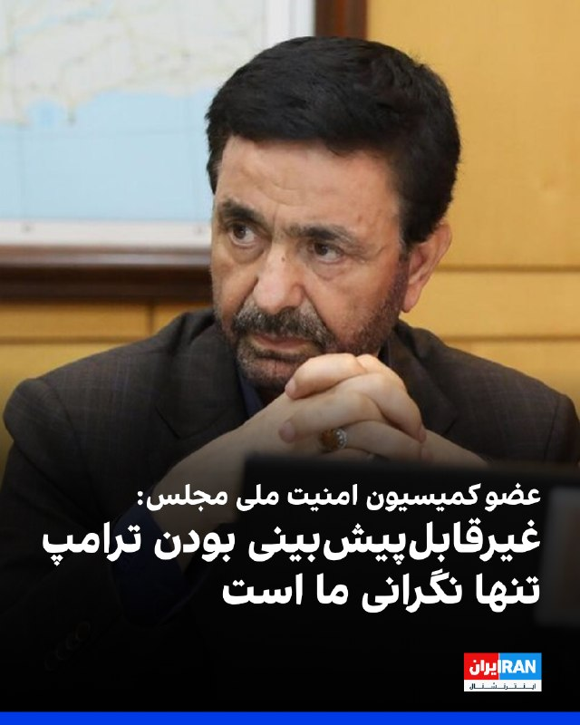
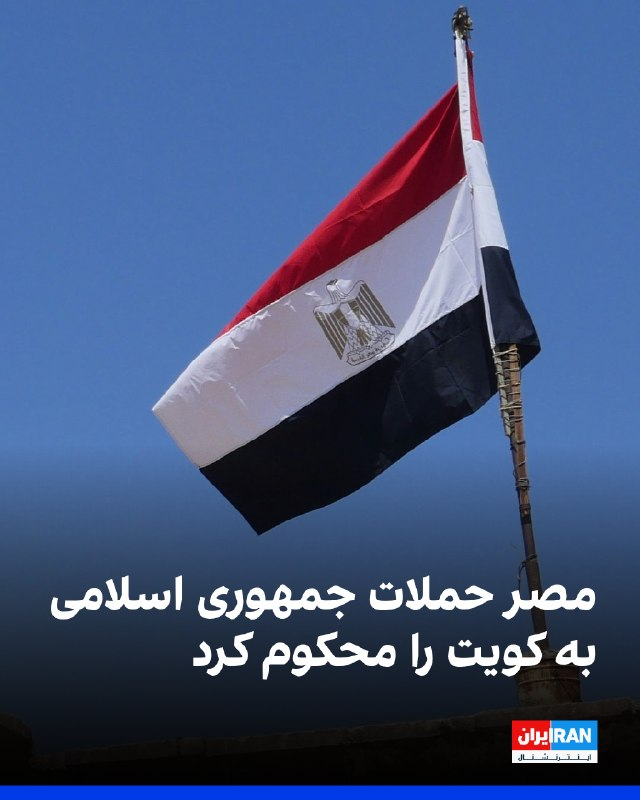

# خواننده تلگرام

<!-- TOP_NAV START -->

<a href="https://github.com/ProAlit/aio-downloader/blob/main/telegram/content/archive_1.md" style="display:inline-block; padding:6px 12px; margin:0 4px; background-color:#2ea44f; color:white; text-decoration:none; border-radius:4px; font-weight:bold;">صفحه بعد</a>

<!-- TOP_NAV END -->

<!-- MSG START -->

---
📅 بروزرسانی: 1405/03/07 19:04
---

## WithYashar — post 12800

آمریکا ۲ شرکت هواپیمایی ایران را تحریم کرد

وزیر خزانه‌داری آمریکا نوشت: دسترسی ۲ شرکت هواپیمایی ایران به نقاط فرود، سوخت‌گیری و فروش بلیت مسدود خواهد شد.
@withyashar

## DEJradio — post 5075

👑
👑 همزمان با بازگشایی اینترنت در ایران، فیلم‌های بسیاری از انقلاب شیر و خورشید در ‌دی‎ماه منتشر شده است.

#انقلاب_شیر_و_خورشید #دیماه
@DEJradio

## VahidOnline — post 75774

اسکات بسنت، وزیر خزانه‌داری آمریکا، روز پنج‌شنبه در پیامی در شبکه ایکس نوشت که ایالات متحده در راستای افزایش فشار بر تهران و باز نگه داشتن تنگه هرمز «دسترسی هر دو شرکت هواپیمایی ایرانی به اماکن فرود، سوخت‌گیری و فروش بلیت را متوقف خواهد کرد»، اما جزئیات بیشتری ارائه نداد و به نام دو شرکت اشاره نکرد.
@VahidHeadline
اسکات بسنت، وزیر خزانه‌داری آمریکا، با تاکید بر اینکه این کشور به کارزار «خشم اقتصادی» علیه حکومت ایران ادامه می‌دهد، در شبکه ایکس نوشت نیروهای جمهوری اسلامی حقوق دریافت نمی‌کنند، پلیس‌ها سر کار حاضر نمی‌شوند و جزیره خارک تعطیل شده است و اقتصاد و ارزش پول ایران در سقوط آزاد قرار دارد.
او افزود سازمان مدیریت تنگه هرمز از سوی جمهوری اسلامی یک شوخی است و امروز وزارت خزانه‌داری آن را تحریم کرده است. ما به هر نهاد شرکتی یا دولتی درباره پرداخت عوارض یا پنهان کردن آن به‌عنوان کمک هشدار داده‌ایم.
بسنت اضافه کرد با تشکیل «دیوار فولادی»، محاصره دریایی آمریکا باعث شده میزان نفت خام ایران در دریا به پایین‌ترین سطح تاریخی برسد.
او تاکید کرد تنها یک نتیجه رضایت‌بخش در مذاکرات این روند نزولی را متوقف خواهد کرد.
@VahidOOnLine
دولت دونالد ترامپ نهاد موسوم به «سازمان تنگه خلیج فارس» جمهوری اسلامی را تحریم کرد
@VahidHeadline

📡 @VahidOnline

## IranIntlTV — post 339433

  <a href="telegram/content/IranIntlTV_339433_1779982447.mp4" target="_blank">🎬 Download video</a>

در ادامه کارزار ایران‌اینترنشنال برای شناسایی پیکرهای جان‌باختگانی که در حیاط پشتی و زیرزمین بیمارستان الغدیر رها شده بودند، هویت جاویدنام دیگری شناسایی شد؛ علی عنبرستانی، ۳۷ ساله که شامگاه ۱۸ دی‌ماه در محله هفت‌حوض تهران با شلیک مستقیم گلوله به سر کشته شد.

براساس اطلاعات رسیده به ایران‌اینترنشنال، علی عنبرستانی در نزدیکی کلانتری هفت‌حوض هدف شلیک مستقیم قرار گرفت و پس از کشته شدن، پیکرش به بیمارستان الغدیر منتقل شد؛ بیمارستانی که در روزهای ۱۸ و ۱۹ دی‌ماه به یکی از مراکز انتقال مجروحان و پیکر جان‌باختگان اعتراضات شرق تهران تبدیل شده بود.

به گفته نزدیکان علی، خانواده پس از ساعت‌ها بی‌خبری، از طریق یکی از آشنایان مطلع شدند که برای پیدا کردن او به بیمارستان الغدیر مراجعه کنند. اما هنگام مراجعه، به آنان گفته شد به دلیل تعداد زیاد پیکرها، خودشان برای شناسایی به زیرزمین بیمارستان بروند.

این منبع آگاه روایت کرده است: رفتیم زیرزمین و دونه‌دونه پیکرها رو نگاه کردیم. آخرین جسد، کنار یک وانت و بغل در بزرگ آهنی بود؛ داداشم اونجا داخل پتو افتاده بود.

براساس این روایت، ماموران و نیروهای حاضر در بیمارستان اجازه انتقال پیکر را به خانواده نمی‌دادند. خانواده عنبرستانی در نهایت پیکر علی را از بیمارستان خارج کردند. پس از انتقال از تهران، به شهر زادگاهش سبزوار منتقل و در آنجا خاکسپاری شد.

## alonews — post 123321

  <a href="telegram/content/alonews_123321_1779982450.webm" target="_blank">🎬 Download video</a>

👈کانال ۱۲ اسرائیل: «شاید نوعی توافق بین عراقچی، ویتکوف، قالیباف، کوشنر و دیگران وجود داشته باشد — اما رهبر ایران و رئیس جمهور آمریکا هیچ تأییدی نداده اند

✅ @AloNews خبر جنگ

## alonews — post 123320

  <a href="telegram/content/alonews_123320_1779982450.webm" target="_blank">🎬 Download video</a>

👈آمریکا ۲ شرکت هواپیمایی ایران را تحریم کرد

🔴وزیر خزانه‌داری آمریکا نوشت: دسترسی ۲ شرکت هواپیمایی ایران به نقاط فرود، سوخت‌گیری و فروش بلیت مسدود خواهد شد.

✅ @AloNews خبر جنگ

---
📅 بروزرسانی: 1405/03/07 18:54
---

## VahidOOnLine — post 242619

  

فداحسین مالکی، عضو کمیسیون امنیت ملی مجلس، گفت «پیشرفت خوبی» در مذاکرات با آمریکا رخ داده و «اغلب پیشنهادات جمهوری اسلامی پذیرفته شده است».
او افزود: «مذاکرات پیشرفت کمی و کیفی قابل‌توجهی داشته و برخی از ملاحظات جمهوری اسلامی باقی مانده که باید از سوی آمریکایی‌ها انجام شود.»
مالکی با اشاره به هدف قرار گرفتن کشتی‌های جمهوری اسلامی در روزهای اخیر گفت: «تنها نگرانی ما غیرقابل‌پیش‌بینی بودن ترامپ و بدعهدی‌های او است.»
او ادامه داد: «سفر قالیباف به قطر درباره موضوع پول‌های بلوکه شده و چگونگی پرداخت آن بود که نتیجه مثبتی برای جمهوری اسلامی داشت.»

‌🏁 🇬🇧 IranintlTV

🤖 @VahidOOnLine

## VahidOOnLine — post 242618

  

وزارت خارجه مصر با انتشار بیانیه‌ای حملات جمهوری اسلامی به کویت را محکوم کرد و نوشت که این حملات، نقض آشکار حاکمیت این کشور و تخلفی جدی از قوانین بین‌المللی به شمار می‌رود.

به گزارش رسانه‌های مصر، در بیانیه وزارت خارجه این کشور آمده است: «امنیت و ثبات کویت و کشورهای خلیج فارس، بخشی جدایی‌ناپذیر از امنیت ملی مصر و جهان عرب است.»
‌🏁 🇬🇧 IranintlTV

🤖 @VahidOOnLine

## pm_afshaa — post 91744

https://t.me/proxy?server=87.248.129.13&port=15&secret=ee1603010200010001fc030386e24c3add63646e2e79656b74616e65742e636f6d

پروکسی متصل سرعت بالا

💧 Rainbet.com the #1 Non-KYC Crypto Casino & Sportsbook @rainbetcom

😁 @Pm_Afshaa

## pm_afshaa — post 91743

  <a href="telegram/content/pm_afshaa_91743_1779981845.mp4" target="_blank">🎬 Download video</a>

حملات سنگین اسراییل به زیر ساخت های حزب الله

💧 Rainbet.com the #1 Non-KYC Crypto Casino & Sportsbook @rainbetcom

😁 @Pm_Afshaa

## VahidOnline — post 75772

وزارت خارجه کویت حملات اخیر موشکی و پهپادی رژیم ایران به خاک کویت را به عنوان یک تشدید تنش جدی و نقض آشکار حاکمیت و امنیت محکوم کرد.
این وزارتخانه روز پنج‌شنبه اعلام کرد که تهران را کاملاً مسئول حملات اخیر می‌داند و حکومت ایران خواست فوراً و بدون قید و شرط حملات را متوقف کند.
@VahidHeadline
اسماعیل بقائی سخنگوی وزارت خارجه ایران، حمله بامداد پنج‌شنبه آمریکا به مناطقی در بندرعباس، را «تجاوز» نامید و آن را محکوم کرد.
آقای بقائی این حمله را «نقض فاحش حقوق بین‌الملل و منشور ملل متحد» دانست و افزود: «شورای امنیت سازمان ملل موظف به ایفای مسئولیت قانونی خود برای پاسخگو کردن متجاوزان آمریکایی است.»
سخنگوی وزارت خارجه ایران می‌گوید آمریکا «به‌طور مستمر»، آتش‌بس میان دو کشور را که از ۱۹ فروردین اجرایی شده، «نقض» می‌کند.
سنتکام با این حال تأکید کرده که این اقدامات «سنجیده، صرفاً دفاعی و با هدف حفظ آتش‌بس» انجام شد. این دومین بار در سه روز گذشته بود که آمریکا اهدافی را در ایران هدف حمله قرار داد.
@VahidHeadline
فرماندهی مرکزی ارتش ایالات متحده، سنتکام، حمله موشکی ایران به کویت را «نفض فاحش» آتش‌بس خوانده است.
این نهاد در حساب رسمی خود در شبکه ایکس نوشته است: «ساعت ۱۰:۱۷ شب به وقت شرق آمریکا در تاریخ ۲۷ مه، ایران یک موشک بالستیک به سمت کویت شلیک کرد که با موفقیت توسط نیروهای کویتی رهگیری شد.»
سنتکام نوشته است «این نقض فاحش آتش‌بس توسط رژیم ایران، ساعاتی پس از آن رخ داد که نیروهای ایرانی پنج پهپاد تهاجمی یک‌طرفه را شلیک کردند که تهدیدی آشکار در تنگه هرمز و نزدیکی آن ایجاد کردند.»
فرماندهی مرکزی ارتش آمریکا می‌گوید: «تمام پهپادها با موفقیت توسط نیروهای آمریکایی رهگیری شدند و آنها همچنین از پرتاب ششمین پهپاد از یک سایت کنترل زمینی ایران در بندرعباس جلوگیری کردند.»
سنتکام در ادامه آورده است: «فرماندهی مرکزی ایالات متحده و شرکای منطقه‌ای کماکان هوشیار و محتاط هستند و ما همچنان به دفاع از نیروها و منافع خود در برابر تجاوز توجیه‌ناپذیر ایران ادامه می‌دهیم.»
@VahidOOnLine
وزارت خارجه عربستان سعودی در بیانیه‌ای در شبکه ایکس، حملات خصمانه با موشک و پهپاد به کویت را به‌شدت محکوم و تقبیح کرد.
@VahidOOnLine
وزارت خارجه قطر در بیانیه‌ای هدف قرار گرفتن کویت با موشک و پهپاد را به‌شدت محکوم کرد و آن را «نقض آشکار حاکمیت» این کشور و «نقض فاحش قوانین بین‌المللی» دانست.
@VahidOOnLine

📡 @VahidOnline

## VahidOnline — post 75771

  

رسانه‌های ایران پیامی منسوب به مجتبی خامنه‌ای، رهبر جمهوری اسلامی، را خطاب به نمایندگان مجلس شورای اسلامی منتشر کردند که در آن می‌گوید «ایجاد تفرقه و تجزیه اجتماعی»، در کنار جنگ و فشار اقتصادی و محاصره، «طرح و نقشهٔ کور دشمن» است.

مجتبی خامنه‌ای در این پیام که روز پنجشنبه هفتم خرداد منتشر شد، همچنین به تمام کسانی که آن‌ها را «جان‌فدایانی که دل‌شان برای اسلام و انقلاب یا استقلال و سربلندی ایران می‌تپد» نامیده، هشدار داد که «اختلافات غیرموجه و حتی موجه را به تنازع و تفرقه تبدیل نکنند».

وزارت اطلاعات جمهوری اسلامی روز گذشته در بیانیه‌ای هشدار داد که بعد از جنگ اخیر، «برخی کمبودها و گرانی‌ها» در پی فشارهای اقتصادی آمریکا می‌تواند باعث بروز ناآرامی‌های تازه در ایران شود.

وال‌استریت جورنال نیز روز پنجشنبه در گزارشی به نقل از تحلیلگران هشدار داد که ادامهٔ محاصرهٔ دریایی آمریکا علیه ایران که به کاهش ذخایر ارزی ایران انجامیده، می‌تواند احتمال بروز اعتراضات جدید در ایران را افزایش دهد.

از زمان اعلام نام مجتبی خامنه‌ای، به عنوان سومین رهبر جمهوری اسلامی، تصویر یا صدایی از او منتشر نشده و رسانه‌های ایران فقط پیام‌های کتبی از او منتشر می‌کنند.
@VahidHeadline

📡 @VahidOnline

## IranIntlTV — post 339432

  <a href="telegram/content/IranIntlTV_339432_1779981848.mp4" target="_blank">🎬 Download video</a>

اداره مهاجرت، پناهندگان و شهروندی کانادا اعلام کرد که در حال توسعه بخشی اختصاصی برای ثبت نتایج آزمون زبان در پورتال درخواست اجازه کار پس از فارغ‌التحصیلی است. این اقدام پس از آن صورت می‌گیرد که به دلیل مشکلات نرم‌افزاری و نبود امکان ثبت مدرک زبان، نزدیک به هزار پرونده در یک سال گذشته به دلیل نقص مدارک رد شده‌اند.
مهسا مرتضوی، خبرنگار ایران‌اینترنشنال، گزارش می‌دهد
@iranintltv

## IranIntlTV — post 339431

  

فداحسین مالکی، عضو کمیسیون امنیت ملی مجلس، گفت «پیشرفت خوبی» در مذاکرات با آمریکا رخ داده و «اغلب پیشنهادات جمهوری اسلامی پذیرفته شده است».
او افزود: «مذاکرات پیشرفت کمی و کیفی قابل‌توجهی داشته و برخی از ملاحظات جمهوری اسلامی باقی مانده که باید از سوی آمریکایی‌ها انجام شود.»
مالکی با اشاره به هدف قرار گرفتن کشتی‌های جمهوری اسلامی در روزهای اخیر گفت: «تنها نگرانی ما غیرقابل‌پیش‌بینی بودن ترامپ و بدعهدی‌های او است.»
او ادامه داد: «سفر قالیباف به قطر درباره موضوع پول‌های بلوکه شده و چگونگی پرداخت آن بود که نتیجه مثبتی برای جمهوری اسلامی داشت.»

https://iranintl.com/202605289167

## IranIntlTV — post 339430

  <a href="telegram/content/IranIntlTV_339430_1779981851.mp4" target="_blank">🎬 Download video</a>

در پی درخواست دونالد ترامپ، رییس‌جمهوری آمریکا، برای پیوستن کشورهای منطقه به پیمان عادی‌سازی روابط با اسرائیل، گمانه‌زنی‌ها درباره پیوستن عربستان سعودی و دیگر کشورهای عربی به پیمان ابراهیم افزایش یافته است. هم‌زمان، برخی ناظران از احتمال شکل‌گیری نظم نوین منطقه‌ای در سایه جنگ با حکومت ایران سخن می‌گویند.
حسین آقایی، عضو تحریریه ایران‌اینترنشنال، در برنامه «پیوست» به این موضوع می‌پردازد
@iranintltv

## alonews — post 123319

  <a href="telegram/content/alonews_123319_1779981855.webm" target="_blank">🎬 Download video</a>

👈ادعای شبکه ۱۲ اسرائیل : رهبر ایران با توافق موافقت نکرده، و این یکی از دلایلی هست که باعث شد ترامپ به نفاهم‌نامه «بله» نگه

✅ @AloNews خبر جنگ

---
📅 بروزرسانی: 1405/03/07 18:43
---

## VahidOOnLine — post 242617

⭕️ عضو کمیسیون امنیت ملی مجلس:
اغلب پیشنهادات ایران در مذاکرات پذیرفته شده، اما ترامپ غیر قابل پیش‌بینی است

♦️فداحسین مالکی، عضو کمیسیون امنیت ملی مجلس شورای اسلامی، با اشاره به سفر مارشال عاصم از پاکستان به ایران مدعی شد که اغلب پیشنهادات ایران در روند مذاکرات مورد پذیرش قرار گرفته است.
او گفت: «از نظر کمیت پیشرفت زیادی داشته‌ایم و برخی از خواسته‌های ایران را آمریکایی‌ها باید انجام دهند.»
مالکی همچنین درباره پول‌های بلوکه‌شده ایران گفت که در این زمینه «پاسخ مثبت» دریافت شده است.
این عضو کمیسیون امنیت ملی، «پیش‌بینی‌ناپذیر بودن رفتارهای دونالد ترامپ» را جدی‌ترین مانع در مسیر مذاکرات عنوان کرد.
‌🇸🇦 Indypersian

🤖 @VahidOOnLine

## mwarmonitor — post 9864

🔴اختصاصی آکسیوس: مقامات می‌گویند آمریکا و ایران به توافق رسیده‌اند، اما این توافق نیازمند تأیید نهایی ترامپ است 📝نویسنده: باراک راوید AXIOS 🔰دو مقام آمریکایی و یک منبع منطقه‌ای درگیر در تلاش‌های میانجی‌گرانه به آکسیوس گفتند که مذاکره‌کنندگان آمریکایی و…

## pm_afshaa — post 91742

🔴یک مقام اسرائیلی: رهبر ایران، موش تباه خامنه‌ای، این توافق را تأیید نکرده و به همین دلیل ترامپ نیز آن را تأیید نکرد

💧 Rainbet.com the #1 Non-KYC Crypto Casino & Sportsbook @rainbetcom

😁 @Pm_Afshaa

## pm_afshaa — post 91741

  

یه سری از حکومتیا خبر از کشته شدن جانشین تنگسیری میدن

💧 Rainbet.com the #1 Non-KYC Crypto Casino & Sportsbook @rainbetcom

😁 @Pm_Afshaa

## VahidOnline — post 75770

  

وزارت دادگستری آمریکا اعلام کرد «جاناتان لودهولت»، شهروند آمریکایی ساکن استاتن آیلند، به‌دلیل مشارکت در طرح «تعقیب و قتل» مسیح علی‌نژاد، فعال سیاسی ایرانی-آمریکایی، به ۱۰ سال زندان و سه سال آزادی تحت نظارت محکوم شده است.
@VahidHeadline

📡 @VahidOnline

## VahidOnline — post 75769

  

محمدباقر قالیباف، رییس مجلس، در پیامی به غلامحسین محسنی اژه‌ای، رییس قوه قضاییه جمهوری اسلامی، نوشت: «قوه قضاییه زیر بمباران و تهدید دشمنان دست از صیانت از حقوق مردم و برخورد با قاتلان داخلی و خائنین به ملت نکشید و خوش درخشید.»

پیام قالیباف در حالی منتشر شده که قوه قضاییه طی ۷۰ روز گذشته، حدود ۴۰ زندانی سیاسی را اعدام کرده است.
@VahidOOnLine

📡 @VahidOnline

## VahidOnline — post 75768

  

نت‌بلاکس، نهاد ناظر بر اختلالات اینترنتی، اعلام کرد که علیرغم اینکه دسترسی به شبکه جهانی تا حد زیادی در ایران بازگشته است، اما شاخص‌ها نشان می‌دهند که کاربران همچنان با فیلترینگ شدید مواجه هستند.

نت‌بلاکس، این فیلترینگ شدید را مشابه دوره مابین اعتراضات سراسری دی ماه و آغاز عملیات نظامی علیه جمهوری اسلامی، حدفاصل دی ماه تا اسفند ۱۴۰۴ توصیف کرد.
@VahidHeadline

📡 @VahidOnline

## VahidOnline — post 75767

  

⚠️ تصاویر پیکرهای بی‌جان و شیون مادر تصاویر دریافتی از: 'بیمارستان الغدیر #تهران، بامداد جمعه ۱۹ دی' Vahid #بیمارسان_الغدیر 📡 @VahidOnline

## IranIntlTV — post 339429

  

وزارت خارجه مصر با انتشار بیانیه‌ای حملات جمهوری اسلامی به کویت را محکوم کرد و نوشت که این حملات، نقض آشکار حاکمیت این کشور و تخلفی جدی از قوانین بین‌المللی به شمار می‌رود.

به گزارش رسانه‌های مصر، در بیانیه وزارت خارجه این کشور آمده است: «امنیت و ثبات کویت و کشورهای خلیج فارس، بخشی جدایی‌ناپذیر از امنیت ملی مصر و جهان عرب است.»
https://iranintl.com/202605281805

## IranIntlTV — post 339428

  <a href="https://t.me/IranintlTV/339428" target="_blank">📎 Download file</a>

🎧نسخه صوتی اخبار نیم‌روزی | پنجشنبه ۷ خرداد
@iranintlTV

## Shin_Persian — post 6283

  

Shin ✓ @hey_itsmyturn
Thu, 28 May 2026 15:10:37 UTC

I'm just sitting and watching and laughing at my timeline :))

فارسی

من فقط نشسته‌ام و تایم‌لاینم را تماشا می‌کنم و می‌خندم :))

𝕏 · @shin_persian

## Persian_Trend_Official — post 15191

  <a href="telegram/content/Persian_Trend_Official_15191_1779981227.webm" target="_blank">🎬 Download video</a>

اکسیوس: ایالات متحده و ایران به پیش‌نویس تفاهم‌نامه 60 روزه ای برای تمدید آتش‌بس و آغاز مذاکرات در مورد برنامه هسته‌ای ایران دست یافته‌اند ولی ترامپ هنوز تأیید نهایی را نداده است. به گفته اکسیوس بیشتر مفاد تا سه‌شنبه این هفته نهایی شده بود و مذاکره‌کنندگان…

## Persian_Trend_Official — post 15190

  

اکسیوس: ایالات متحده و ایران به پیش‌نویس تفاهم‌نامه 60 روزه ای برای تمدید آتش‌بس و آغاز مذاکرات در مورد برنامه هسته‌ای ایران دست یافته‌اند ولی ترامپ هنوز تأیید نهایی را نداده است.

به گفته اکسیوس بیشتر مفاد تا سه‌شنبه این هفته نهایی شده بود و مذاکره‌کنندگان ایرانی اعلام کردند که تأییدیه‌های لازم برای امضا را کسب کرده‌اند. همچنین ترامپ در جریان این توافق‌نامه قرار گرفته است، اما به میانجی‌ها گفته است که برای بررسی آن چند روز زمان می‌خواهد.

این تفاهم‌نامه پیشنهادی کشتیرانی بدون محدودیت از طریق تنگه هرمز و عدم پرداخت عوارض یا مزاحمت را تضمین می‌کند و ایران را ملزم می‌کند که تمام مین‌های دریایی را ظرف 30 روز از تنگه هرمز خارج کند. در عوض، محاصره دریایی ایالات متحده به تدریج با از سرگیری کشتیرانی تجاری برداشته می‌شود.

طبق پیش‌نویس توافق، ایالات متحده همچنین موافقت می‌کند که در مورد کاهش تحریم‌ها، آزادسازی دارایی‌های مسدود شده ایران بحث کند.

📝 Amir

📌 @persian_trend_official
پرشین ترند | متفاوت‌ترین کانال نظامی

## IranianMinds — post 20954

🔴بنیامین نتانیاهو:

با هدف از بین بردن کامل تهدید ایران هر روز با ترامپ در تماس هستم و باید مأموریت علیه ایران را به پایان رساند.

@IranianMinds

## BBCPersian — post 282275

📽آیا تا به حال از کافه‌های سیار خیابانی یک نوشیدنی یا ساندویچ خریدید؟ به قصه‌های پشت این کافه‌ها فکر کردید؟

🔹ذکرا و فرزاد قهرمان‌های فیلم، دو تا جوان نوشکفته هستند که می‌خواهند روی پای خودشان بایستادند. با چی؟ با یک ون و ساندویچ‌های خانگی و تبلیغات اینستاگرام با آنها آشنا بشوید.

📺برنامه این هفته آپارات
«ذکرا و فرزاد»

🎬ساخته ابراهیم مختاری

🔹ساعات پخش به وقت ایران
جمعه ۹ شب
شنبه ۷ صبح
شنبه ۱۲:۰۰ ظهر
دوشنبه ۲:۳۰ صبح
دوشنبه ۸:۳۰ شب
سه‌شنبه ۱۲ ظهر
جمعه ۱۲ ظهر

🔹از برنامه آپارات همیشه فیلم متفاوت ببینید.

@BBCPersian

## Hranews — post 113212

  

پرونده موسوم به “شهرک اکباتان”؛ یاسمین دشتانی به حبس محکوم شد

❗️
❗️
❗️
❗️
❗️– یاسمین دشتانی، یکی از متهمان پرونده موسوم به “شهرک اکباتان”، با حکم قاضی صلواتی به پنج سال حبس و مجازات های تکمیلی محکوم شد.

به گزارش خبرگزاری هرانا، ارگان خبری مجموعه فعالان حقوق بشر در ایران، یاسمین دشتانی، یکی از متهمان پرونده موسوم به “شهرک اکباتان” به حبس محکوم شد.

بر اساس حکمی که توسط شعبه ۱۵ دادگاه انقلاب تهران به ریاست قاضی ابوالقاسم صلواتی صادر و به خانم دشتانی ابلاغ شده، وی از بابت اتهام اجتماع و تبانی برای ارتکاب جرم علیه امنیت ملی به پنج سال حبس، دو سال ممنوعیت از عضویت در احزاب و گروه‌های سیاسی، دو سال منع اسکان در استان های تهران و البرز و دو سال منع فعالیت در فضای مجازی محکوم شده است.

ادامه مطلب

#یاسمین_دشتانی

↘️
@hranews_bot تماس ✉️ - @Hranews کانال هرانا 🆑

## alonews — post 123318

  <a href="telegram/content/alonews_123318_1779981229.webm" target="_blank">🎬 Download video</a>

👈کالاس ،مسئول سیاست خارجی اتحادیه اروپا: ایران و ایالات متحده در حال حاضر در مرحله‌ای بسیار خطرناک میان جنگ و صلح قرار دارند.

🔴 ادامه این جنگ به نفع هیچ‌کس نیست.

✅ @AloNews خبر جنگ

## alonews — post 123317

  <a href="telegram/content/alonews_123317_1779981230.webm" target="_blank">🎬 Download video</a>

👈اسکات بسنت، وزیر خزانه‌داری آمریکا: هرگونه تلاش برای اعمال سیستم عوارض در تنگه هرمز را تحمل نمی‌کنیم و هر بازیگری که مستقیم یا غیرمستقیم در تسهیل آن نقش داشته باشد، هدف قرار خواهد داد

✅ @AloNews خبر جنگ

<!-- MSG END -->

<!-- NAV START -->

<a href="https://github.com/ProAlit/aio-downloader/blob/main/telegram/content/archive_1.md" style="display:inline-block; padding:6px 12px; margin:0 4px; background-color:#2ea44f; color:white; text-decoration:none; border-radius:4px; font-weight:bold;">صفحه بعد</a>

<!-- NAV END -->
